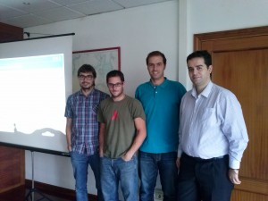

O pasado 7 de Outubro tivemos unha presentación do proxecto ao diferentes investigadores do CSIC os cales hoxe nos achegaron a seguinte carta de recomendación ([Orixinal sen sinaturas](http://xeopesca.com/wp-content/uploads/2013/10/Carta-xeoPesca_senSinaturas.pdf)).

_Con motivo da recente presentación de “xeoPesca” como proxecto de fin de carreira por D. Pablo Belay Fernández, e a sua candidatura a VI edición do premio o mellor proxecto de fin de carreira con licencia libre convocado pola Axencia para a Modernización Tecnolóxica de Galicia (Amtega) da Xunta de Galicia para o ano académico 2012-2013, os abaixo firmantes queren mostrar o seu apoio a este proxecto, e manifestar o seu interese por esta aplicación informática._

\[caption id="attachment\_219" align="aligncenter" width="300"\] CSIC - Vigo (Visita do 7 de Outubro de 2013)\[/caption\]
