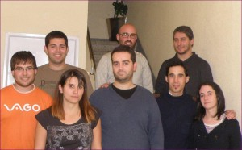

O pasado 1 de novembro reunironse diferentes membros da comunidade de xeoPesca na Estrada. Debateuse sobre o futuro da aplicación e prioridades. Chegando aos seguintes acordos:

1. Constituirse como asociación de software libre  para o mantemento da aplicación.
2.  Posta en producción nun servidor de xeoPesca
3. Contribuir a investigación, desenvolvemento e difusión da ferramentas libres a través de proxectos desenvoltos pola propia asociación ou conxuntamente con outras entidades. Promover a utilización de formatos, estándares, recomendacións e especificacións abertas a fin de asegurar a interoperabilidade entre sistemas.

