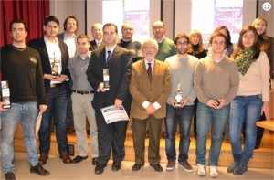

This morning they were delivered on the Campus of Ourense awards of the 13th edition of the contest for Technology Projects organized Expourense , in collaboration with the School of Computing of Ourense , which involved are graduates of the different schools of Informatics and Telecommunications of the Galician universities .

The winning project of the mode A ( Middle Grade titles ) was the "virtual distributor advertising " designed by Ivan Mato Varela , a student at the University of Vigo , Campus of Ourense. It is an advertising system that supports small businesses by offering the possibility of a useful way to reach their customers using new technologies. Submit a platform for companies to present their products and offers shops using three platforms : web space (where the sellers hang their offers and discounts that reach users provided they are in a certain range ) , a mobile application ( where customers receive these offers ) and finally , this would not be possible without the joint Google Maps as bonding tool between vendor-customer and customer - offer.

The second prize was awarded to this modality work " gHRV Application for android" Diego Anton Cerqueira , a student of the University of Vigo. It is an application that allows clinical use a graphical analysis of the variability of heart rate.

The third prize went to Belay Pablo Fernández , University of A Coruña, with its " Xeopesca " , a software solution that offers the creation of a register of fishing activity that brings competitive advantages based on the experience of owners and fishermen .

Regarding the B ( Higher Level Titles ) mode, the winning project was the " System management and optimization of client visits and distribution of orders" , designed by Diego Dominguez Calvo , student of Computer Science at the University of Vigo . This is a new system of cost savings in the generation and distribution tour route orders through a genetic algorithm. The main objective of the project is to achieve cost savings in the tour route travel by commercial agents and achieve greater customer satisfaction of the company.

The second award was for this mode "Scheduling Algorithms on a GPU Reduction " project Adrián Pérez Dieguez, Computer Engineer from the University of A Coruña. The project aims to harness the power of graphics cards to develop a program able to handle data and perform calculations, a much faster than we can find on the market today and so . The applications are very diverse, from the acceleration of scientific calculations , to the engineering industry , to cryptography , finance, gaming or medical sector.Esta mañana fueron entregados en el Campus de Ourense los premios de la 13ª edición del Concurso de Proyectos Tecnológicos que organiza Expourense, en colaboración con la Escuela Superior de Informática de Ourense, en el que participaron titulados de las distintas escuelas de Informática y Telecomunicaciones de las universidades gallegas.

El proyecto ganador de la modalidad A (títulos de Grado medio) fue el "Repartidor virtual de publicidad", diseñado por Iván Varela Mato, estudiante de la Universidad de Vigo, Campus de Ourense. Se trata de un sistema de publicidad que apoya al pequeño comercio ofreciéndole la posibilidad, de una manera útil, de llegar a sus clientes empleando las nuevas tecnologías. Propone una plataforma que permita a las empresas dar a conocer sus productos y las ofertas de sus tiendas mediante el uso de tres plataformas: espacio web (allí donde los vendedores colgarán sus ofertas y descuentos, que llegarán a los usuarios siempre que éstos se encuentren en un determinado radio de acción), una aplicación móvil (donde los clientes recibirán estas ofertas) y por último, esto no sería posible sin la articulación de Google Maps como herramienta de unión entre vendedor-cliente y cliente-oferta.

El segundo premio de esta modalidad recayó en el trabajo "Aplicación gHRV para android" de Diego Antón Cerqueira, alumno de la Universidad de Vigo. Se trata de una aplicación de uso clínico que permite realizar un análisis gráfico de la variabilidad de la frecuencia cardíaca.

El tercer premio fue para Pablo Belay Fernández, de la Universidad de A Coruña, con su proyecto "Xeopesca", una solución informática que ofrece la creación de un registro de actividad pesquera que aporta ventajas competitivas en función de la experiencia de armadores y pescadores.

En lo que respecta a la modalidad B (Títulos de Grado Superior) el proyecto ganador fue el "Sistema de gestión y optimización de visitas a clientes y distribución de pedidos", diseñado por Diego Calvo Domínguez, estudiante de Ingeniería Informática en la Universidad de Vigo. Se trata de un novedoso sistema de ahorro de costes en la generación de rutas de visita y distribución de pedidos a través de un algoritmo genético. El objetivo principal del proyecto es el de conseguir un ahorro de costes en el recorrido de rutas de visita por parte de agentes comerciales y conseguir una mayor satisfacción de los clientes de la empresa.

El segundo premio de esta modalidad fue para el proyecto "Programación de Algoritmos de Reducción en una GPU" de Adrián Pérez Diéguez, ingeniero informático por la Universidad de A Coruña. El proyecto trata de aprovechar la potencia de las tarjetas gráficas para desarrollar un programa capaz de manejar datos y de realizar cálculos, de una manera mucho más rápida que las que podemos encontrar a día y hoy en el mercado. Las aplicaciones son muy diversas, desde la aceleración de cálculos científicos, hasta la industria de las ingenierías, pasando por la criptografía, las finanzas, los videojuegos o el sector médico.

 

Esta mañá , foron entregados no Campus de Ourense premios da 13 ª edición do concurso de proxectos de Tecnoloxía organizado Expourense , en colaboración coa Escola de Informática de Ourense , que implica son graduados das diferentes escolas de informática e telecomunicacións da universidades galegas.

O proxecto gañador para a A (títulos Grao Medio) foi o " distribuidor de publicidade virtual" deseñado por Ivan Mato Varela, un estudante da Universidade de Vigo, Campus de Ourense. É un sistema de publicidade que apoia as pequenas empresas , ofrecendo a posibilidade de un xeito útil para acadar os seus clientes a través de novas tecnoloxías. Enviar unha plataforma para que as empresas presentan os seus produtos e ofrece tendas utilizando tres plataformas : espazo web (onde os vendedores colgar as súas ofertas e descontos que alcanzan os usuarios sempre que estean en un determinado intervalo ), unha aplicación móbil (onde os clientes reciben estas ofertas ) e finalmente , iso non sería posible sen Google Mapas conxuntas como ferramenta de conexión entre provedor -cliente e oferta ao cliente.

O segundo premio foi concedido a este traballo modalidade " GVDH aplicación para Android " Diego Cerqueira Anton , un estudante da Universidade de Vigo. É unha aplicación que permite o uso clínico dunha análise gráfica da variabilidade da frecuencia cardíaca.

O terceiro premio foi para Belay Pablo Fernández, da Universidade de A Coruña, co seu " Xeopesca ", unha solución de software que ofrece a creación dun rexistro das actividades de pesca que trae vantaxes competitivas con base na experiencia dos propietarios e pescadores.

En relación ao modo ( Nivel Superior Títulos ) B , o proxecto gañador foi o " Sistema de xestión e optimización de visitas a clientes e distribución de pedidos ", deseñado por Diego Dominguez Calvo , estudante de Ciencia da Computación da Universidade de Vigo . Este é un novo sistema de redución de custos na orde de xeración e distribución de rutas de turismo a través dun algoritmo xenético. O principal obxectivo do proxecto é acadar economías de custo na viaxe ruta de turismo por axentes comerciais e acadar unha maior satisfacción dos clientes da empresa.

O segundo premio foi para esta modalidade " algoritmos de escalonamento na redución GPU " proxecto de Adrián Pérez Diéguez , Enxeñeiro de Computación da Universidade da Coruña . O proxecto ten como obxectivo a aproveitar o poder das tarxetas gráficas para desenvolver un programa capaz de manexar datos e realizar cálculos , un moito máis rápido do que podemos atopar no mercado hoxe e así. As aplicacións son moi diversas , desde a aceleración de cálculos científicos, para a industria de enxeñaría , á criptografía , finanzas, xogos ou sector médico.

+Info: [http://www.expourense.org/not.php?id=115#.UuZ9HvS0rsM](http://www.expourense.org/not.php?id=115#.UuZ9HvS0rsM)
