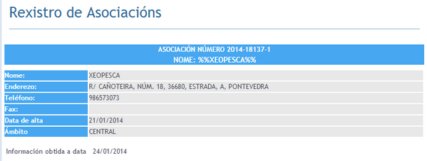

O pasado 21 de xaneiro a Xunta de Galicia deu de alta e validou os [Estatutos da Asociación XeoPesca](http://xeopesca.com/wp-content/uploads/2014/01/estatutos.pdf) a como asociación de software libre.

\[caption id="" align="alignnone" width="599"\] Rexistro de Asociacions Xunta de Galicia\[/caption\]

Os asociados acordaron que os fins da asociación son:

-   Desenvolver, promocionar e divulgar o uso das ferramentas libres (software e/ou hardware) na sociedade
- Contribuir a investigación, desenvolvemento e difusión da ferramentas libres a través de proxectos desenvoltos pola propia asociación ou conxuntamente con outras entidades
- Promover a utilización de formatos, estándares, recomendacións e especificacións abertas a fin de asegurar a interoperabilidade entre sistemas.
- Formación das novas tecnoloxías no eido do Software Libre e o hardware libre nos diferentes ámbitos (educativo, empresarial, administrativo, …)
- Promoción da pesca sostible e responsable.
- Divulgación dos valores da pesca artesanal e ecolóxica.
- Preservación do medio ambiente mariño.
- Colaboración coas cofradías de pescadores e ou institucións semellantes e organismos adicados a investigación pesqueira.
- Calquera outro que os asociados determinen en Asamblea Xeral.
