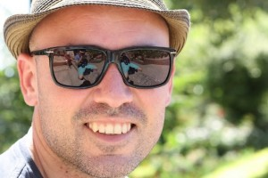

O pasado sábado día 1 rematou finalmente o proceso de elección da xunta de goberno do Colexio Profesional de Enxeñaría Técnica en Informática de Galicia (CPETIG). A xunta electoral proclamou elixida a única candidatura presentada aos devanditos comicios.

A xunta directiva está conformada por Marcos Mata, presidente, Juan Luis Miguéns, secretario, Rocío Colmeiro, vicesecretaria, Edgar Rodríguez, tesoureiro, Anxos Cabado, vicetesoureira, e os vogais Miguel abal, Fernando González, Juan Carlos Mira e Xosé Rial.

Xosé Rial tamén e membro da directiva de XeoPesca onde ten o cargo de Secretario da Asociación. O pasado sábado día 1 rematou finalmente o proceso de elección da xunta de goberno do Colexio Profesional de Enxeñaría Técnica en Informática de Galicia (CPETIG). A xunta electoral proclamou elixida a única candidatura presentada aos devanditos comicios.

A xunta directiva está conformada por Marcos Mata, presidente, Juan Luis Miguéns, secretario, Rocío Colmeiro, vicesecretaria, Edgar Rodríguez, tesoureiro, Anxos Cabado, vicetesoureira, e os vogais Miguel abal, Fernando González, Juan Carlos Mira e Xosé Rial.

Xosé Rial tamén e membro da directiva de XeoPesca onde ten o cargo de Secretario da Asociación. O pasado sábado día 1 rematou finalmente o proceso de elección da xunta de goberno do Colexio Profesional de Enxeñaría Técnica en Informática de Galicia (CPETIG). A xunta electoral proclamou elixida a única candidatura presentada aos devanditos comicios.

A xunta directiva está conformada por Marcos Mata, presidente, Juan Luis Miguéns, secretario, Rocío Colmeiro, vicesecretaria, Edgar Rodríguez, tesoureiro, Anxos Cabado, vicetesoureira, e os vogais Miguel abal, Fernando González, Juan Carlos Mira e Xosé Rial.

Xosé Rial tamén e membro da directiva de XeoPesca onde ten o cargo de Secretario da Asociación.
