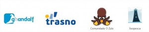

XeoPesca Mancomun includes as one of the regional free software agents. Mancomun is to unify all efforts to free and open source software (FLOSS) being developed in different areas, institutional volunteers, business, education, etc..

mancomun - Axentes FLOSS en GaliciaMancomun incluye la XeoPesca como uno de los agentes de software libre regional. Mancomun es unificar todas las iniciativas de software libre y de código abierto (FLOSS) que se están desarrollando en diferentes áreas, de voluntarios institucional, empresarial, educativo, etc.

mancomun - Axentes FLOSS en Galicia[Mancomún inclue a XeoPesca](http://www.mancomun.org/conecemancomun/axentesflossgalegos/) como un dos axentes FLOSS de ámbito autonomico. Mancomún é aglutinador de todas as iniciativas sobre software libre e de fontes abertas (FLOSS) que se están a desenvolver en Galicia dende os diferentes ámbitos; institucional, empresarial, educativo, voluntariado, etc.

\[caption id="attachment\_301" align="alignnone" width="467"\] mancomun - Axentes FLOSS en Galicia\[/caption\]
