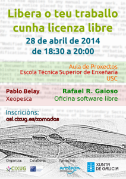
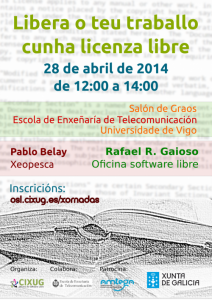

O próximo luns 28 de Abril fumos convidados a varias charlas sobre a liberación de proxectos e traballos.  Os horarios son os seguintes:

- **Vigo:** As 12:00 na  Escola Enxeñaría de Telecomunicación. [+Info](http://osl.cixug.es/events/libera-o-teu-traballo-cunha-licenza-libre-ed-vigo/ "Evento Vigo")
- **Santiago de Compostela** : As 18:00 na  Escola Técnica Superior de Enxeñaría. [+Info](http://osl.cixug.es/events/libera-o-teu-traballo-cunha-licenza-libre-ed-vigo/ "Evento Santiago de Compostela")

### Relatores

- **Rafael Rodríguez Gaioso** é Coordinador da Oficina de Software Libre, integrada no Consorcio das universidades galegas, CIXUG. É membro fundador de MeLiSA, a asociación de usuarios de software libre da Terra de Melide.
    - Fará unha introdución dalgunha das licenzas máis usadas para liberar código, e cales son os motivos polos que un programador decide publicar o seu traballo cunha licenza libre. Presentará a edición 2014 do Premio ao mellor TFG con licenza libre.

- **Pablo Belay** é desenvolvedor e responsable da comunidade da aplicación GIS XeoPesca.
    - XeoPesca foi premiada con diferentes galardóns nos que destaca: Premio ao mellor PFC con licenza libre 2013 e os Premios de PortalProgramas nas categorías Maís revolucionario e Maior potencial de crecemento.
    - Na súa charla falaranos sobre dita aplicación e contará a súa experiencia na liberación de dita aplicación.

Carteis das Xornadas:    Referencias:

- Fonte da imaxen de cabeceira: [Flickr](https://www.flickr.com/photos/adulau/3011878917/sizes/m/in/photolist-5A9EER-fLyQA8-abwwb1-81LPL-9YRiUm-9YNqoc-pZvNx-55fJq7-6hbJvz-c2eXqw-4JZqBQ-6o3mJG-3t4km-Ahtjx-7mis1-6UaPSX-5gm73-aB4ivt-LV31W-8UAthy-8veRzU-5dD9d5-d1z5h-4JNAjF-8UxnQP-8UArwG-5ugFB8-a1xmWo-c2h9qG-4H614e-4vUig4-8V1EY6-aocxR3-f4uiJD-27nyE-5pxQw8-jsC8d-3WtN1f-4yZJhY-5dD95A-4v9uaR-c2h7bf-5dD91Q-5dD8WU-vRSZw-5dyNy2-8Sv3V6-eLMZAV-iqgygN-dscbAJ/ "Flickr By Sa")
