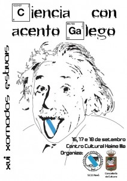

\[caption id="attachment\_356" align="alignright" width="212"\] XVI Xornadas Estivales - Raxo - Poio\[/caption\]

A [Sociedade Cultural de Raxó](http://raxocultural.org/) convidounos a presentar o proxecto XeoPesca o vindeiro 16 de Setembro de 2014 as 20:00h no Centro Cultural Xaime Illa. Esta presentación é parte da rolda de palestras organizadas baixo o marco das "XVI Xornadas Estivais ".Este ano as xornadas títulanse **Ciencia con acento acento galego,** cabe destacar a presenza de:

- **Victor** **L****ópez** presidente de **Eganet**, Asociación de Empresas e Profesionais galegos das Novas Técnoloxías e a Rede.
- **Marcus Fernández,** webmáster en **Código Cero**, revista galega sobre tecnoloxía. Tamén é membro da directiva da asociación Punto Gal que ven de por en marcha ,o pasado 25 de xullo, o dominio propio galego.
- **Pepe o de Redondela,** subdirector, da revista 'Lingua e Dereito', que edita a Universidade de Vigo. Presidente da Fundación dos Premios da Crítica Galicia e colaborador da Enciclopedia Galega Universal, da Editorial Ir Indo.
- **Antonio Montero Carro**, enxeñeiro técnico industrial, ten experiencia en empresas como os laboratorios Zeltia. Alí desempeñou os cargos de primeiramente Técnico de I+D+i  e posteriormente responsable de operacións. Ademáis foi  xerente do Consello da Cultura Galega.Actualmente é o Director de Xestión do Museo Provincial de Pontevedra.

Para máis información sobre a programación podedes consultar o seguinte link : [http://raxocultural.org/xvi-xornadas-estivais-ciencia-acento-galego/](http://raxocultural.org/xvi-xornadas-estivais-ciencia-acento-galego/)

**Localización**:

- Enderezo: Rúa Igrexa, 18 36992 Raxo (Poio) Pontevedra
    
- Coordenadas: 42.4066903,-8.7405666
- Ligazón a [openstreetmap](http://www.openstreetmap.org/#map=18/42.40325/-8.75595&layers=C)
- Ligazón a [googleMaps](https://www.google.es/maps/place/S.C.D.+Rax%C3%B3/@42.4066903,-8.7405666,3136m/data=!3m1!1e3!4m5!1m2!2m1!1sCentro+Cultural+Xaime+Illa,+Poio!3m1!1s0x0:0xac0873246b73e3ef?hl=es)
