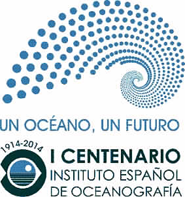

\[caption id="attachment\_375" align="alignright" width="185"\] Centenario IEO\[/caption\]

O [Instituto Español de Oceonografía (IEO)](http://www.ieo.es/web/ieo) é unha organización pioneira en España, tamén é unha das primeiras do mundo, que comezou a dedicarse enteiramente á investigación do mar e os seus recursos. O Instituto foi creado polo Dr Odón de Buen o 17 de Abril 1914 como resultado da integración nun mesmo organismo dos Laboratorios de Bioloxía Mariña de Santander, Mallorca e Málaga preexistentes.O Instituto fúndouse seguindo as directrices científicas estandarizadas polo Instituto-Museo Oceanográfico de Mónaco.Cabe salientar que no ano 1980, o  pasar a depender do Ministerio de Agricultura, Pesca y Alimentación; convírtese en asesor da administración pesqueira. Na Galicia temos dous centros do IEO un en [Vigo](http://www.vi.ieo.es/index.aspx) (1917) e outro en  [A Coruña](http://www.co.ieo.es/)  (1972) alí realízanse múltiples estudos de gran utilidade para o sector mariñeiro. A investigación desenvólvese en tres áreas de actividade: medio mariño e protección ambiental,pesquerías e acuicultura. Na Coruña realizáranse os seguintes actos para a celebración do centenario:

- **Setembro do 14 ao 19.** Visitas guiadas ao Buque Oceanográfico Ángeles Alvariño
- **Setembro do 14 ao 19.** ICES Annual Science Conference 2014
- **Outubro do 14 ao 28.** Exposición dos 100 anos de investigación no mar.

En Vigo serán os seguintes:

- **Setembro do 22 ao 26.** Grupo de traballo del ICES Working Group on Methods of Fish Stock Assessments (WGMG).
- **Novembro do 11 ao 13.** Grupo de trabaloo del convenio OSPAR sobre as basuras mariñas.
- **Novembro do 17 ao 21.** Grupo de trabaloo do ICES "The Working Group on Acoustic and Egg Surveys for Sardine and Anchovy in ICES Areas VII, VIII and IX"
