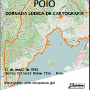

O sábado 11 de abril no Centro Xaime Illa de Raxó ( Poio)  chega as festas das festas, a **Mapping Party Poio’15** co obxectivo é pasalo ben mentres aumentamos os datos xeográficos cunha licenza libre   da contorna marítima do Concello de Poio. Este obradoiro estará organizado pola asociación pola Asociación de software libre Xeopesca e conta coa colaboración da Concellaría de Cultura do Concello de Poio e as asociacións SCD Raxo e ACDeM Armadiña. **Horario**

- 10:00-11:00 Presentación de OSM, organización de equipos para a zona a cartografiar.
- 11:00-14:00 Traballo de Campo con explicacións de como empregar osmAndroid.
- 14:00 -16:00 Xantar.
- 16:00-20:00 Traballar coas computadoras para o verquido de datos OSM
- 20:00-20:30 Clausura do curso.

### **Formulario de Inscrición**

Para inscribirse a Mapping Party Poio’15 cubre o formulario. ([ver aquí](https://docs.google.com/forms/d/15v52U9Zjwy4GpwQdU3ViK7ZYJJsCtBRUtrJrw1jzg2s/edit#))

### **Asistentes**

O número de asistentes será de 25. A selección dos candidatos realizarase por orde de inscrición. Recoméndase a disposición de  calquera dos seguintes dispositivos: GPS, teléfono con GPS e cámara dixital. 

<iframe style="border: 1px solid black;" src="http://www.openstreetmap.org/export/embed.html?bbox=-8.757382929325104%2C42.403051783861024%2C-8.752903640270233%2C42.40485013856018&amp;layer=mapnik&amp;marker=42.4039509676542%2C-8.755143284797668" width="425" height="350" frameborder="0" marginwidth="0" marginheight="0" scrolling="no"></iframe>

 [Ver mapa más grande](http://www.openstreetmap.org/?mlat=42.40395&mlon=-8.75514#map=19/42.40395/-8.75514)

### **Material funxible**

Farase entrega a cada un dos asistentes dun blogue de notas, un bolígrafo e un lápis.

### **Redes Sociais**

Establecemos o hashtag #mappingpartypoio para seguir o evento a través das redes sociais. Ademais tamén Podes seguir a Mapping Party Poio’15 a traves de [twitter](https://twitter.com/xeopesca%20 ) mediante o hashtag #mappingpartypoio ou no [páxina de facebook de XeoPesca](https://www.facebook.com/xeopesca?fref=ts).

Esta actividade forma parte das actividades que a asociación Xeopesca realiza no marco do convenio de colaboración asinado coa Axencia para a Modernización Tecnolóxica de Galicia (AMTEGA), e incluídas no Plan de Acción de Software Libre 2015 da Xunta de Galicia.
