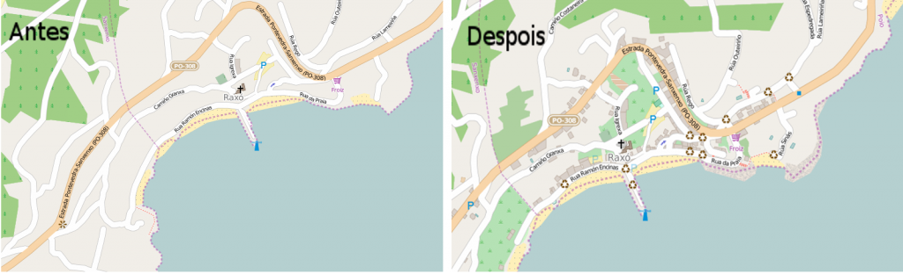

O pasado sábado xeoPesca organizou a súa primeira Mapping Party no concello de Poio con moi boa aceptación. Reuniuse un grupo de vintedúas persoas de diferentes localidades galegas,de diversos rangos de idade e inquedanzas variadas co obxetivo común de aprender a mapear.

A xornada dividiuse en dúas partes principais: a saída de campo para a recollida de información e o volcado de datos. Diferentes membros  da asociación xeoPesca estiveron a cargo da parte teorica-técnica necesaria para levar a cabo a Mapping,cunha pequena exposición de contidos. Logo, a dinámica foi colaborativa e cun estilo de obradoiro, adaptandoo a información as preguntas dos asistentes.

A idea principal sempre foi ter unha xornada de aprendizaxe lúdico sobre a creación de mapas de información aberta. As ferramentas principais usadas foron Open Street Maps como soporte para os datos recollidos e a app OSM tracker como ferramenta de recollida de datos, a parte de notas en papel.

Nas seguintes imaxes  podese ver o traballo realizado polos participantes. Nelas podese apreciar o rexistro dunha gran cantidade de información xeográfica sobre Raxó.

 Dende a asociación estamos satisfeitos coa experiencia e agradecidos ao Concello de Poio, a Armadiña e a Asociación Cultural de Raxó pola súa colaboración neste evento.\[Best\_Wordpress\_Gallery id="13" gal\_title="Mapping party Poio 15"\]
