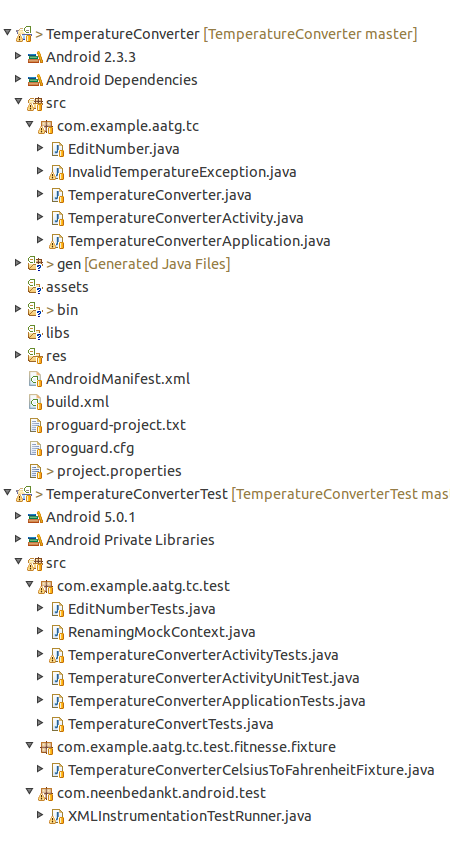
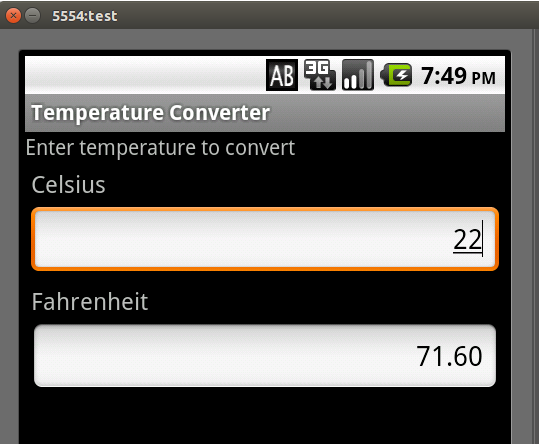
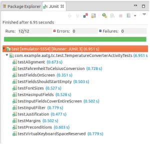
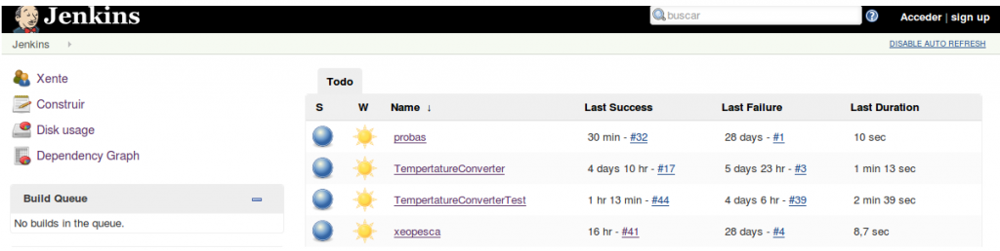
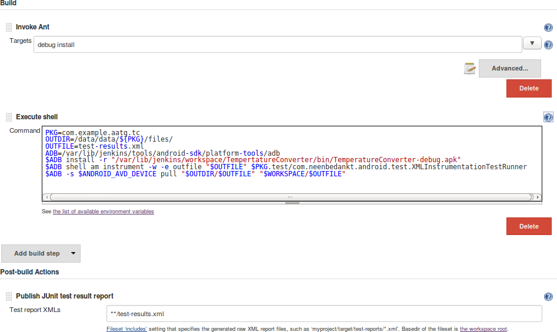
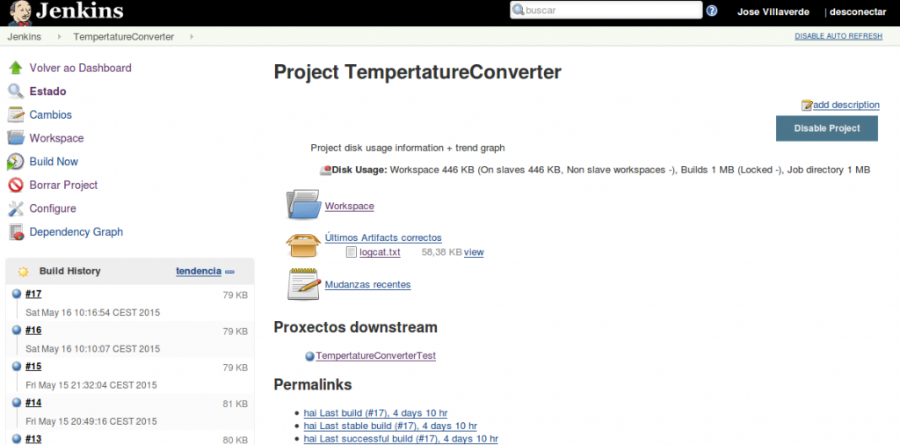
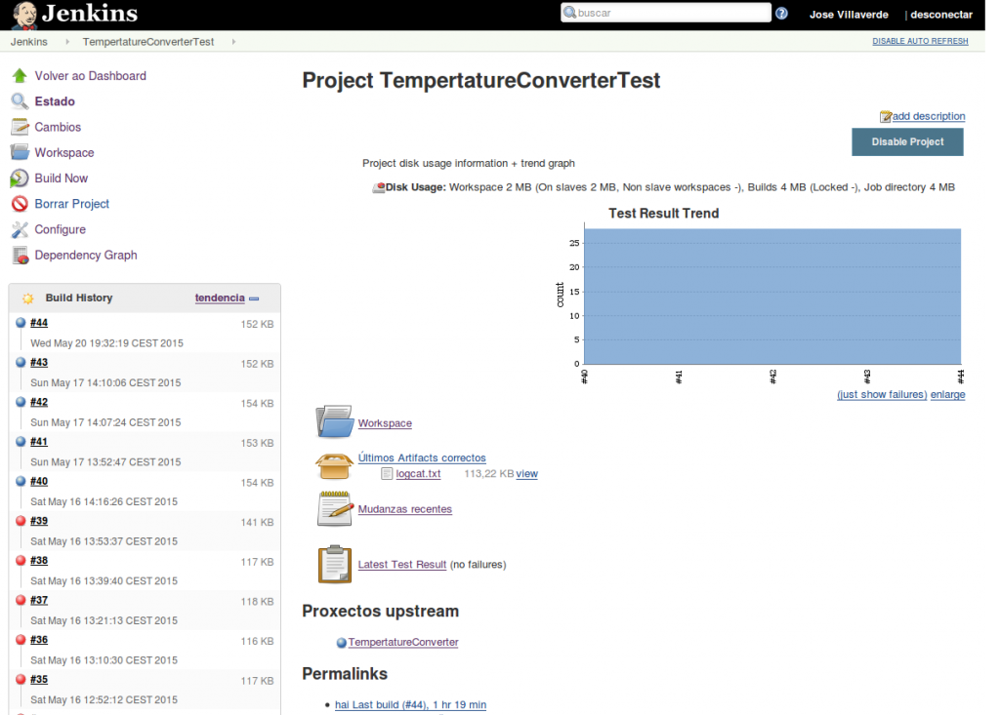
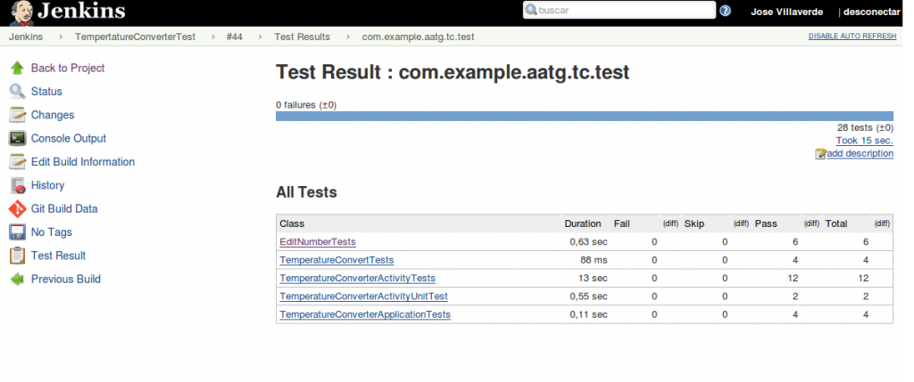

O libroAndroid Application Testing Guide de Diego Torres Milano é unha excelente guía para achegarse ao mundo do “testing”, neste caso baixo a tecnoloxía Android.  Os seus primerios capítulos fálanos de como os “bugs”' poden afectar seriamente aos nosos proxectos e de porqué, que, como e cando testear. Indicanos que tipo de tests existen e preséntanos un “framework” de testeo de Android. O libro o debemos seguir ao mesmo tempo que facemos lectura do código fonte. Nun principio aproxímanos aos test unitarios e aJunit a través dun pequeno proxecto, e fai mostra da execución dos test desde oIDE Eclipse, desde o emulador e desde a liña de comandos.

Pero abreviando, se estamos interesados no tema é doado conseguir o libro e nel podemos ver todo o que trata, eu fago unha rápida enumeración dos temas : Assertions, TouchUtils, Mock objects, TestCase, TDD (Test Drive Development), Android Testing Environment, Behavior Driven Development, Testing Recipes (Android Unit tests, Activities, Applications, Database and ContentProviders, Local and Remote Services, Uis, Exceptions,Parsers, and Memory leaks), Continous Integration, Performance Testing e Alternative Testing Tacktics (EMMA, Robotium, testing on hosts e Roboelectric). oda esta temática a mostra desenvolvendo unha aplicación denominada TemperaturaConverter e outra que vai actúar sobre esta facendo o “testing”, TemperaturaConverterTest. Na imaxen da esquerda pódense apreciar os dous proxectos no IDE Eclipse xa publicados tamén no **repositorio Git** de xeoPesca. Todas as clases situadas no paquete **com.example.aatg.tc.test** encarganse das labores de testeo. A clase situada no paquete **com.example.aatg.tc.test.fitnesse.fixture** vainos a permitir ver en funcionamento do framework de testing [http://fitnesse.org/](http://fitnesse.org/) , esto non o trato neste artigo. Finalmente, a clase XMLInstrumentationTestRunner.java, do paquete **com.neenbedankt.android.test,** vai a permitir mostrar os resultados dos test que son almacenados en formato XML no Jenkins. Por defecto android.test.InstrumentationTestRunner non da soporte para almacenamentos deste tipo, con esta clase facemos unha extensión para proporcionar a funcionalidade que falta. Se ben o libro da indicacións para executar a aplicación nun emulador Android eu o fixen tanto nun emulador (no servidor e a nivel local) como nun dispositivo real (a nivel local). Esta aplicación serve para facer a conversión, de graos fahrenheit a graos centígrados e a inversa. Establecín o idioma do dispositivo Android a Inglés Americano pois se non, tiña problemas co símbolo de separacións dos decimais, punto contra coma. A miña prioridade era ver todo en funcionamento e non me parei as estudar no código para facer unha adaptación.

\[caption id="attachment\_464" align="alignright" width="350"\] TemperatureConverter executándose no emulador Android en local.\[/caption\]

Unha vez en marcha o proxecto, TemperatureConverter, no emulador ou dispositivo real, lanzamos un dos test a nivel local e vemos os resultados:

\[caption id="attachment\_465" align="alignright" width="300"\] TemperatureConverterActivityTest executado.\[/caption\]

Despois de explicar o “testing” o libro entra no mundo da integración continua. En concreto mostra como montar unha aplicación Android manualmente coa tecnoloxía Ant, facer uso dun repositorio Git e levar a cabo a integración continua con Hudson, que é o pai de Jenkins. Decidín montar este entorno exposto no libro: **Ant, Android, Git e Hudson**, co único cambio do software de integración continua -en vez do Hudson o **Jenkins**\-, o servidor de xeoPesca dispón dun repositorio Git e ten instalado o Jenkins. Tiven que facer uso do comando android para convertir o proxecto a tecnoloxía Ant, o arquivo build.xml foi creado: **$ cd <path/to>/TemperatureConverter** **$ android update project --path $PWD --name TemperatureConverter** No libro se deron os pasos para empregar un emulador predeterminado e lle foi indicando a Ant o nome do mesmo, eu omitín eses pasos. O proxecto TemperatureConverterTest seguiu un porceso similar de conversión: **$ cd /TemperatureConverterTest** **$ android update test-project --path $PWD --main <path/to>/ TemperatureConverter** Até agora todo o feito foi a nivel local, pero agora toca subir o código ao repositorio Git, como as probas de test vainas a levar a cabo o Jenkins instalamos nel un **plugin do emulador Android** que supostamente instala automaticamente o SDK. Nun principio non foi así e tiven que facelo manualmente. Finalmente, no momento en que realizaba probas, o Jenkins fixo a instalación do SDK tal e como estaba previsto fora de prazo e sen previo aviso. Tiven que retirar a instalación previa do SKD. Para adaptar o entorno android tiven que facer uso da liña de comandos, agora o SDK atópase no servidor e non o usamos a nivel local onde os IDE simplifican o seu uso. Tiven varios contratempos, non sempre coinciden as explicacións do libro co entorno real, tomei nota de todo por si no futuro fora de axuda. Un dos maiores problemas que topei foi un 'bug' que a día de hoxe non está solucionado, tiven que procurar na rede e atopar unha solución temporal. Polo resto indiqueille ao Jenkins a situación do código no repositorio Git e despois configurei as dúas aplicacións para poder levar a cabo as probas de 'testing'.

\[caption id="attachment\_466" align="aligncenter" width="625"\] As dúas aplicacións no Jenkins\[/caption\]

As configuracións indicadas no libro sobre o Jenkins en algúns casos non son moi exactas, pero a base de facer probas e procuras pola rede vaise chegando ao obxectivo.

\[caption id="attachment\_467" align="alignright" width="947"\] Configuración no Jenkins do TemperatureConverterTest\[/caption\]

Ao Jenkins se lle ten que indicar a situación de TemperatureConverter e TemperatureConverterTest. Desde a configuración do proxecto TemperatureConverterTest, se ten que indicar que o proxecto a testear é TemperatureConverter. Que durante a construción do proxecto tense que executar como un emulador Android e indicarlle as propiedades do mesmo, e finalmente anótanse os comandos Ant é unha serie de variables e comandos para a execución dun “script”.

 Cando falei do código, indiquei que existe unha clase que vai a dar soporte para poder publicar os datos dos tests no Jenkins, debemos facer uns cambios tamén no AndroidManifest.xml, en concreto:

<instrumentation android:targetPackage\=_"com.example.aatg.tc"_ android:name\=_"com.neenbedankt.android.test.XMLInstrumentationTestRunner"_ />

Estes cambios imposibilitan os test a nivel local pero habilitan o entorno no servidor.

 Pódese apreciar no apartado “Proxectos downstream” a relación establecida entre os dous proxectos.

\[caption id="attachment\_470" align="aligncenter" width="625"\] TemperatureConverterTest\[/caption\]

A nivel local no Eclipse contamos con un rexistro “LogCat”, podemos ver que no servidor non perdemos esta funcionalidade, logcat.txt

\[caption id="attachment\_469" align="aligncenter" width="625"\] Resultados dos test\[/caption\]

Agora podemos seguir a traballar sobre o código , a **integración continua** xunto co **TDD** van a guiarnos cara a construción dun código mais robusto. O Jenkins permítenos empregar outras tecnoloxías, **Maven**, **Gradle**, etc...

O libro Android Application Testing Guide de Diego Torres Milano é suministrado pola editorial Packt xunto ao código fonte [https://www.packtpub.com/application-development/android-application-testing-guide](https://www.packtpub.com/application-development/android-application-testing-guide) .

**Autor** **do artigo**: Jose Luis Villaverde

**Dúbidas, suxerencias**: jlvbalsa@mundo-r.com

**GPG key:** [07A9C84C](https://pgp.mit.edu/pks/lookup?op=get&search=0xA93FC7B507A9C84C)
