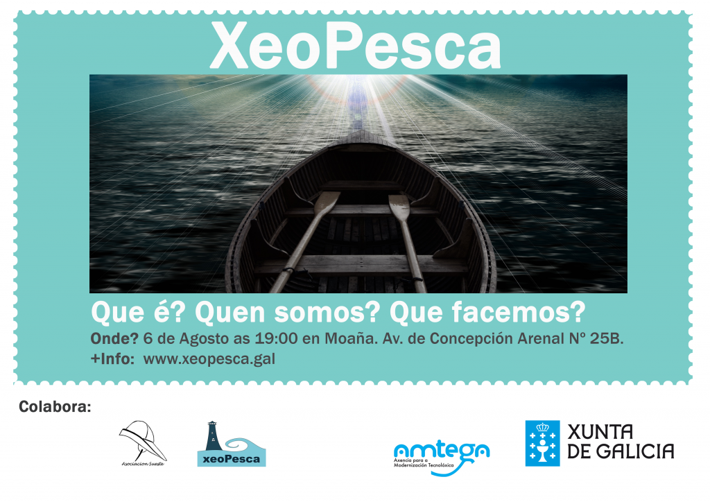

Presentación de XeoPesca en Moaña. No estaleiro da [Asociación Cultura e Recreativa Sueste](https://www.facebook.com/pages/Asociaci%C3%B3n-Cultura-e-Recreativa-Sueste/167953466605243) , na Avenida de Concepción Arenal Nº 25B. Intentaremos respostar as preguntas:

- Que somos?
- Que facemos?
- Que queremos?

e as vosas preguntas 

Esta actividade forma parte das actividades que a asociación Xeopesca realiza no marco do convenio de colaboración asinado coa Axencia para a Modernización Tecnolóxica de Galicia (AMTEGA), e incluídas no Plan de Acción de Software Libre 2015 da Xunta de Galicia.
