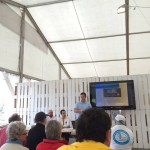

\[caption id="attachment\_506" align="alignleft" width="150"\] Presentación en Combarro.\[/caption\]

Durante o mes de agosto realizamos diferentes presentacións da aplicación xeoPesca e das vantaxes que aporta o software libre nun sector estratéxico como a pesca.

Nesta xira achegamonos as vilas de Moaña, Bueu e Combarro (Poio), para elo contamos coa colaboración de: Asociación Cultura e Recreativa Sueste, Asociación os Galos e o Concello de Poio nas súas festas do mar.

O numero total de asistentes que se interesaron polo proxecto foi de máis de 50 persoas e contou coa colaboración voluntaria dos soci@s da da asociación. Nas presentacións falouse primeiramente da traxectoria da asociación, onde o público interesentouse pola Mapping Party e a importancia da disposición de coñecemento libre co fin de beneficiar a sociedade e permitir un desenvolvemento igualitario, viuse o exemplo da realizada en Raxó (Combarro) no mes de Abril. Nunha segunda parte falouse propiamente da aplicación xeoPesca a cal se acompañou dunha demostración en vivo en diferentes dispositivos como tablets, mobil e computadora portatil. Os asistentes fixeron preguntas sobre os seguintes temas:

- A explotación sinxela da información pesqueira dos lances e faenas, o cal lles aporta unha maior competitividade e aforro de combustible.
- A xestión responsable dos recursos mariños, ao dispor de datos fidedignos xerados por eles mesmos.
- A gratuidade da ferramenta e que se pode adaptar totalmente.

Finalmente falamos  do futuro da asociación que se centrará na mellora da aplicación "xeoPesca" e a realización de obradoiros de temática de Software e Hardware Libre. Esta actividade forma parte das actividades que a asociación Xeopesca realiza no marco do convenio de colaboración asinado coa Axencia para a Modernización Tecnolóxica de Galicia (AMTEGA), e incluídas no Plan de Acción de Software Libre 2015 da Xunta de Galicia.
