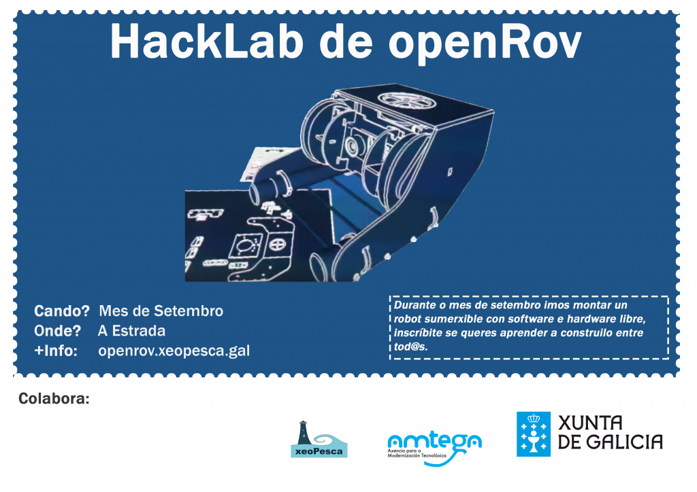

Dende xeoPesca prácenos presentar o HackLab de montaxe dun OpenRov, que arrancará o sábado 5  de Setembro ás 10:30  quedamos diante do Concello da Estrada, para posteriormente achegarnos ao local onde comenzaremos o HackLab.

Xa dende hai tempo se está a ver unha gran evolución no mundo do hardware libre, cunha maior presencia na sociedade. Froito desta evolución son os robots, impresoras 3d, consolas(uzebox),.....  e tamén o OpenRov.

xeoPesca, non quere quedar atrás neste mundo e inicia a súa andaina con este HackLab que será en múltiplas sesións e como obxectivo rematar montando unha robot sumerxible para o uso d@s XeoPesqueir@s.

A idea do HackLab é a de crear un grupo de traballo cooperativo de carácter aberto e fomentando a aprendizaxe autónoma e cooperativa de tódolos membros. Dende xeoPesca  agradecemos que se estiveras interesado neste HackLab te [inscribas no formulario do event](https://docs.google.com/forms/d/1rHSzXKjWl-LD7PSIPUXgxgwFy9EBFumziPng-iBoLUo/viewform?usp=send_form)o tan pronto como puideras, para poder permitirnos organizar mellor o evento.

_**Que é OpenRov?**_

OpenROV é unha especie de drone submarino, forma parte dunha nova tendencia chamada DIY (do it your self) ou "faino ti mesmo", que se basea na utilización de compoñentes open source, os cales pouco a pouco, están a gañar terreo.

Un ROV (remotely operated vehicle) é un vehículo submarino controlado a distancia. OpenROV é un robot explorador creado por dous amigos californianos, Eric Stackpole e David Lang, que lograron dar a luz ao seu proxecto, grazas a Kickstarter - mesmo a National Geographic lle brindou o seu apoio financeiro.

Este dispositivo é guiando dende unha PC portátil, e equipado cunha cámara HD, este "submarino" do tamaño dunha caixa de zapatos, pode alcanzar os 100 m de profundidade (polo momento).

O OpenROV (Open Source Remote Operated Vehicle) é unha idea colectiva dunha comunidade que se pasiona polos robots teleguiados. Os planos do aparato, as instrucións, así como o software baseado en GNU/Linux, están dispoñibles gratuitamente para descargalos, [no sitio wiki do proxecto.](http://openrov.dozuki.com/)

Esta actividade forma parte das actividades que a asociación Xeopesca realiza no marco do convenio de colaboración asinado coa Axencia para a Modernización Tecnolóxica de Galicia (AMTEGA), e incluídas no Plan de Acción de Software Libre 2015 da Xunta de Galicia.
