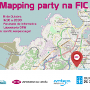
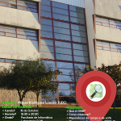
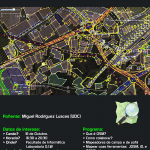

O venres 16 de Outubro na Facultade de Informática da Coruña  chega as festas das festas, a **Mapping Party FIC’15** co obxectivo de descobrer OpenStreetMap e pasalo ben mentres aumentamos os datos xeográficos cunha licenza libre. Este obradoiro estará organizado pola asociación polas Asociacións de software libre Xeopesca e GPUL e  conta coa colaboración da AMTEGA e a Facultade de Informática da Coruña.

Nesta actividade existe un máximo de participantes polo que será imprescidible [inscribirse no seguinte formulario.](https://docs.google.com/forms/d/1PemVepFDU7REnHPMp54Zh3pmAKOi5WLH_QS-W4RKxTQ/viewform) 

  

 

 

 

 

A actividade comenzará as 16:30 e rematará as 20:30, tendo o seguinte programa:

- Qué o OSM?
- Cómo se contribúe a OSM?
    - Mapeadores de campo: OSMTracker
    - Mapeadores de salón: iD, JOSM
- División en equipos para mapear.
    - Mapeadores de campo \[se o tempo o permite\]
    - Mapeadores de salón

Esta actividade forma parte das actividades que a asociación Xeopesca realiza no marco do convenio de colaboración asinado coa Axencia para a Modernización Tecnolóxica de Galicia (AMTEGA), e incluídas no Plan de Acción de Software Libre 2015 da Xunta de Galicia.
