O [proxe](http://www.tamar.org.br/)[c](http://www.tamar.org.br/)[to TAMAR](http://www.tamar.org.br/) esta situado na **praia do Forte**, estado de **Salvador de Bahía**, **Brasil**. É un proxecto orientado a **preservación das tartarugas-mariñas** ameazadas de extinción.

[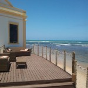](http://xeopesca.com/wp-content/uploads/2015/11/IMG_20151012_170351-e1447428542469.jpg)[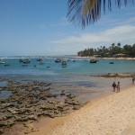](http://xeopesca.com/wp-content/uploads/2015/11/IMG_20151012_170319-e1447428445518.jpg)[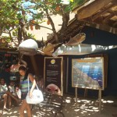](http://xeopesca.com/wp-content/uploads/2015/11/IMG_20151012_171527-e1447428858690.jpg)[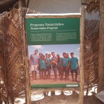](http://xeopesca.com/wp-content/uploads/2015/11/IMG_20151012_171302-e1447428974141.jpg)

* * *

[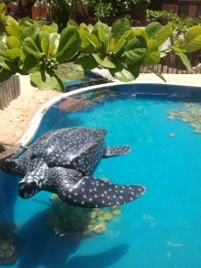](http://xeopesca.com/wp-content/uploads/2015/11/IMG_20151012_165736-e1447429198457.jpg)O nome do proxecto é a contracción das palabras tartaruga e mariña, necesaria para imprimir nas placas metálicas empregadas na identificación dos espécimes, para **estudos de biometría, seguimento das rutas migratorias e outros**.

A idea xurdiu nos anos 70 a través dun grupo de estudantes de oceanografía que viaxaban a praias desertas para realizar observacións. Este grupo documentou no arrecife do '[Atol das Rocas](https://pt.wikipedia.org/wiki/Atol_das_Rocas)' a pescadores matando tartarugas, fotos e documentos foron aportados as autoridades sendo este o xerme do proxecto **TAMAR** fundado no ano **1980**.

Nun principio o proxecto centrouse nas **tartarugas-mariñas** pero posteriormente empezouse a dar apoio ao desenvolvemento das comunidade costeiras, ofrecéronse alternativas económicas para poder diminuír a caza das tartarugas-mariñas. O proxecto ampliouse tamén a protección das **quenllas** e **outras especies mariñas**.

[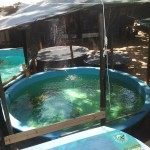](http://xeopesca.com/wp-content/uploads/2015/11/IMG_20151012_171448-e1447435476715.jpg)[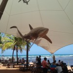](http://xeopesca.com/wp-content/uploads/2015/11/IMG_20151012_170454-e1447429554805.jpg)[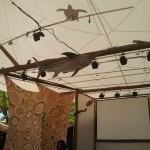](http://xeopesca.com/wp-content/uploads/2015/11/IMG_20151012_170447-e1447429619919.jpg)[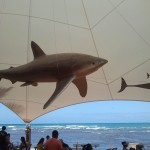](http://xeopesca.com/wp-content/uploads/2015/11/IMG_20151012_170431-e1447429414957.jpg)

[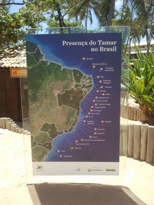](http://xeopesca.com/wp-content/uploads/2015/11/IMG_20151012_170736-e1447429828342.jpg)A súa actividade esta concentrada en **21 bases** distribuídas en 1100 Km de costa. Para garantir a conservación das tartarugas promovese a conservación dos ecosistemas mariño e costeiro e o desenvolvemento das comunidades próximas as bases, estratexia coñecida como 'especie-bandeira' ou 'especie-guarda-chuva'. As actividades envolven actualmente a cerca de 1200 persoas.

**Son cinco as especies** de tartarugas mariñas atopadas no Brasil que continúan en ameaza de extinción. Catro desovan no litoral, son as mais amezadas: **_cabezuda_** _(Caretta caretta)_, **_depente_** _(Eretmochelys imbricata)_, **oliva**(_Lepidochelys olivacea_) e de _**couro**(dermochelys coriacea)_. A **_tartaruga verde_**_(Chelonia mydas)_ está menos exposta pois desova principalmente nas illas oceánicas (Atol das Rocas, Fernando de Noroña e Trinidade) onde a acción do home está mais controlada.

[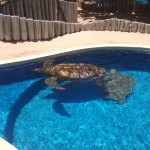](http://xeopesca.com/wp-content/uploads/2015/11/IMG_20151012_165703-e1447430035511.jpg)[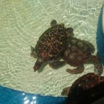](http://xeopesca.com/wp-content/uploads/2015/11/IMG_20151012_165746-e1447430090971.jpg)[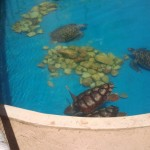](http://xeopesca.com/wp-content/uploads/2015/11/IMG_20151012_171141-e1447430168500.jpg)[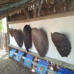](http://xeopesca.com/wp-content/uploads/2015/11/IMG_20151012_171048-e1447430262957.jpg)

[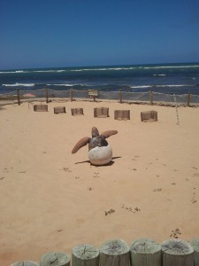](http://xeopesca.com/wp-content/uploads/2015/11/IMG_20151012_170849-e1447430558833.jpg)Até os anos 80, inicio do proxecto, os escasos rexistros dispoñíbeis suxerían a existencia de desovas de tartaruga ao longo do toda a costa brasileira, desde Rio de Janeiro até o Amapá. Segundo datos de pescadores e algúns historiadores, xa nese tempo identificábase unha **redución entorno ao 60% da poboación** de tartarugas (datos non oficiais).

As tartarugas son altamente migratorias, desovan nun país e aliméntanse noutro. Teñen un ciclo de vida complexo e longo, a maduración sexual e tardía, acadan a idade adulta aos 30 anos. **A recuperación da súa poboación é lenta**. Este ciclo biolóxico estaba sendo interrompido, cando as femias chegaban a praia a desovar case sempre eran matadas e os ovos recollidos,outras tartarugas quedaban presas nas redes de pesca (hoxe aínda ocorre).

Mais grave aínda é que **este ciclo biolóxico estaba interrompido**, pois as femias que alcanzaban a praia para desovar case sempre eran matadas e seus ovos recollidos - e moitos animais eran capturados pola pesca, estes son feitos que aínda acontece hoxe.

**De cada mil tartarugas que nacen, soamente unha ou dúas conseguen chegar a idade adulta**. Ademais dos depredadores naturais as accións do home son as principais ameazas: pesca accidental ao longo de toda a costa con redes de espera, e en alta mar, con anzois e redes de deriva, contaminación do alumeado, transito de vehículos nas praias de desova, destrución do hábitat para desova pola ocupación desordenada do litoral, a contaminación dos océanos e o quecemento global.

[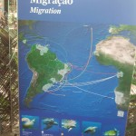](http://xeopesca.com/wp-content/uploads/2015/11/IMG_20151012_170934-e1447432216225.jpg)[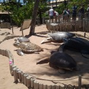](http://xeopesca.com/wp-content/uploads/2015/11/IMG_20151012_170716-e1447430706293.jpg)[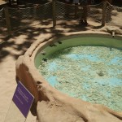](http://xeopesca.com/wp-content/uploads/2015/11/IMG_20151012_165906-e1447430878184.jpg)

Os resultados, tal e como indican na web oficial:

“**Aos 35 anos, o Projeto Tamar comemora a soltura de 20 milhões de filhotes ao mar**. É [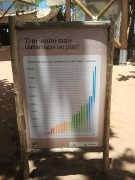](http://xeopesca.com/wp-content/uploads/2015/11/IMG_20151012_170545-e1447431458875.jpg)uma conquista da sociedade brasileira e de todas as pessoas que trabalham corajosamente para proteger as tartarugas marinhas, lembra o coordenador nacional e um dos fundadores do Tamar, Guy Marcovaldi. Alcançamos resultados importantes ao longo desses 35 anos, pois nasceu uma nova geração de tartarugas marinhas no Brasil que aos poucos vai reconquistando as nossas praias. Infelizmente, apenas um de cada mil dessesde filhotes vai sobreviver. Existem apenas 7.300 fêmeas, aproximadamente, desovando no país, e uma tendência consolidada de crescimento das populações de tartarugas marinhas. As [redes de pesca](http://tamar.org.br/interna.php?cod=73) são a maior das ameaças e as luzes artificiais nas praias de desova ([fotopoluição](http://tamar.org.br/interna.php?cod=106)), entre outros perigos, podem diminuir este número drasticamente. Por isso, precisamos do apoio de toda a sociedade para proteger esses animais ameaçados de extinção.”

[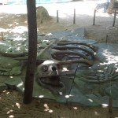](http://xeopesca.com/wp-content/uploads/2015/11/IMG_20151012_171010-e1447431736641.jpg)[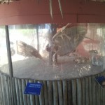](http://xeopesca.com/wp-content/uploads/2015/11/IMG_20151012_171100-e1447431797977.jpg)[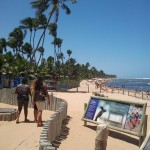](http://xeopesca.com/wp-content/uploads/2015/11/IMG_20151012_165638-e1447435880556.jpg)[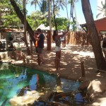](http://xeopesca.com/wp-content/uploads/2015/11/IMG_20151012_171352-e1447431944658.jpg)

[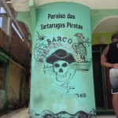](http://xeopesca.com/wp-content/uploads/2015/11/IMG_0395-e1447433348498.jpg)[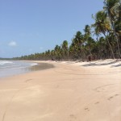](http://xeopesca.com/wp-content/uploads/2015/11/IMG_0521-e1447433397416.jpg)[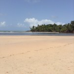](http://xeopesca.com/wp-content/uploads/2015/11/IMG_0528-e1447433438859.jpg)

Até aquí chegou esta pequena aportación sobre o mundo mariño.

O pasado martes 10 de novembro , na biblioteca Anxel Casal, Xurxo Mariño Alfonso, doutor en Ciencias Biolóxicas pola Universidade de Santiago de Compostela, profesor da Universidade da Coruña, neurocientífico e divulgador, pronunciou unha charla **_Ciencia, aventuras e sorpresas dunha viaxe arredor do mundo_** na que describiu, dende unha perspectiva científica, a viaxe na que visitou desertos, glaciares, volcáns, selvas e montañas. Un dos puntos que visitou foron as illas Galápagos de gran riqueza biolóxica, indicou que próximanente publicara un libro sobre o tema. Se queredes aproximaros ao tema, existen unha serie de videos en youtube que reproducen a charla nun instituto de educación: [parte 1](https://www.youtube.com/watch?v=EJMLO8HU3Yg).  (para rirse e asombrarse un pouco, minuto 18:14 do video 4)

Falado de tartarugas, lembrar que seguimos a estudar o metasistema operativo ROS !)

Fontes documentación: páxina oficial TAMAR e Wikipedia.

Fotos: realizadas directamente polo autor do artigo.

**Autor**: José Luis Villaverde Balsa  **Correo**: jlvbalsa@mundo-r.com [![[ Celebrate 30 years of GNU! ]](images/GNU_30th_badge.png)](https://gnu.org/gnu30)
