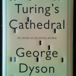
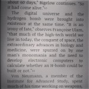
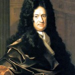
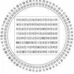
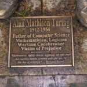
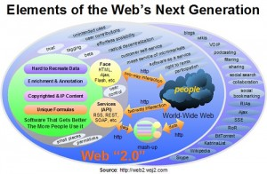
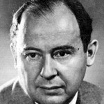
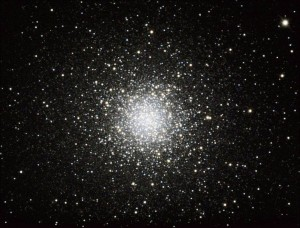

**_George Dyson_** o historiador da tecnoloxía ven de publicar o libro _**“Turing's Cathedral. The Origins of the Digital Universe”**_, anteriormente ten publicado “Baidarka”, “Porject Orion” e “Darwing among the Machine”. Este libro facilita información que nos pode axudar a comprender a próxima revolución informática. Existen dúas preguntas que debemos ter en mente ao longo de toda a lectura, en 1950 **_Turing_** pedía que considerásemos a pregunta “**poden pensar as máquinas?**” . Por outra banda temos a pregunta de **_Von Neumann_**, “**comezarán a reproducirse as máquinas?**”. O universo dixital debe os seus comezos a Leibniz que proporciona a lóxica, a Alan Turing e ao conxunto de científicos encabezados por Von Neumann que construíron as máquinas.

No principio do relato o autor preséntanos unha relación de todos os físicos, matemáticos, enxeñeiros, meteorólogos, administrativos, filántropos, militares, lóxicos, avogados, astrofísicos e criptógrafos que interveñen na historia. Se chegan a proporcionar datos en gran detalle de moitos deles, da súa orixe, ideoloxía, infancia, matrimonios, etc... Indícase que moitos matemáticos europeos chegan aos EEUU como consecuencia da purga acometida polos nazis nas universidades alemáns en 1933 e seguindo o exemplo de Einsten, este éxodo coincide ca apertura das portas do **Instituto de Estudos Avanzados**.

Sobre o primeiro computador ofrécese tamén unha descrición detallada de como foi a súa construción precisando o tipo de pezas empregadas, o funcionamento de compoñentes tales como a memoria, reles, condensadores, tubos de baleiro, etc. Chamoume a atención un dato que nunca antes escoitara, a gravación de datos chegou a facerse nun cable de aceiro que xiraba sobre unhas rodas de bicicleta, un paso previo a construción dos discos duros.

O que si queda claro despois de ler o libro e que as computadoras foron creadas pola necesidade militar de crear bombas nucleares. **A bomba de hidróxeno e o universo dixital emerxeron ao mesmo tempo**. Estas máquinas simularán o encadeamento de explosións producido polas bombas. “Si en 1945 non se tomara a decisión de fabricar un ordenador, o programa termonuclear se houbera atrasado o bastante como para que foran os soviéticos os que tivesen as primeiras armas”. A capacidades destas computadoras para realizar cálculos foron aproveitadas por outras ciencias tales como a da meteoroloxía. Anteriormente algún meteorólogo chegou a expor a a idea de dividir a superficie da terra en 3200 cuadrículas meteorolóxicas e retransmitir por telégrafo as observacións do momento a unha gran sala con galerías abovedades e un anfiteatro central situado a un nivel inferior onde unha 64000 calculadoras humanas recollerían a información para acometer os cálculos . Posteriormente, en setembro de 1953, o Servizo Meteorolóxico, a forza aérea e a mariña acordaron crear unha unidade conxunta de predición meteorolóxica numérica, en xaneiro de 1954 un grupo consultivo técnico presidido por Von Neumann recomendo o uso dunha IBM 701, a primeira previsión meteorolóxico operativa realizouse o 18 de abril de 1955.

Unha vez construídas as computadoras chegouse a conclusión de que “O computador de programa almacenado, tal como foi concibido por Alan Turing e construído por John Von Neumann, **veu a romper a distinción entre números que significan cousas e números que fan cousas**. **O noso universo xa nunca volverá a ser o mesmo**”. E para ter unha percepción global da evolución do universo dixital teremos en mente que “O modelo de computación universal de Turing era unidimensional, unha serie de símbolos codificados nunha cinta. En cambio, a materialización que fixo Von Neumman do modelo Turing era de dúas dimensións, a matriz de direccións subxacente a todos os computadores que se empregan hoxe. Ca introdución de internet, a paisaxe volta tridimensional, permitindo a evolución de códigos metazoos simultaneamente distribuídos en múltiples servidores”.

Nun dos capítulos faixe referencia a _**Leibniz**_, “que consideraba que a **codificación binaria** era a clave dunha linguaxe universal, atribuía o mérito da súa invención aos chinos, vendo nos hexagramas do “**I Ching**” os restos dunha aritmética binaria .... que eu redescrubín uns miles de anos mais tarde”, en 1679 Leibniz concibiu un computador dixital no que os números binarios eran representados por figuras esféricas, “ A crenza de Leibniz nunha codificación dixital universal encarnaba un principio de máxima diversidade: complexidade infinita a partir de regras finitas”.

No [vídeo onde Laercio Fonseca](https://www.youtube.com/watch?v=Ae9TCJak2cQ) describe o que é o “I Ching”, podemos constatar que tal e como indica Leibniz o código binario e invención dos chinos. Laercio indica que o símbolo do Ying/Yang é unha representación da ecuación fundamental do universo (ou do movemento no universo) ca cal se poderán prever estados futuros ao igual que a ecuación fundamental do movemento dos planetas pode prever a entrada das estacións do ano e tamén os eclipses. Este símbolo trata de representar unha figura esférica que conten as enerxías que se producen nas flutuacións do Ying e o Yang ,o cal garda certo paralelismo ca representación dos números binarios por figuras esféricas de Leibniz. O “I Ching” emprega hexagrama para representar todos os cambios posibles de estados, no mundo da informática estaríamos a falar de 2^6 (**64 bits**). Os chineses baseándose nestes principios **construíron un oráculo** para prever o futuro. Mais adiante veremos que o uso dun oráculo entra tamén nas propostas de Turing.

Adicase un capítulo a **Turing**, relátanse detalles da súa vida e de como aparece en escena, explícase o funcionamento da máquina de Turing e narra a historia da máquina Enigma. Chegado un punto “Turing comezou a preguntarse como podía superar as limitacións puramente determinista....... A continuación, Turing invoca unha nova clase de máquinas que procedían de maneira determinista, paso a paso, pero que a súa vez cando daban saltos non deterministas, consultando, por así dicilo, a unha especie de oráculo”. “Non afondaremos na natureza deste **oráculo**, aparte de dicir que **non pode ser unha máquina – explicaba (o mellor dito, non explicaba)** Turing-. Coa axuda do oráculo, poderíamos formar unha nova clase de máquinas (chamémoslles **máquinas-O**)”. Turing mostraba que se podían construír enunciados indescritíbeis, refractarios á axuda dun oráculo externo, de modo que o [Entscheidungproblem](https://es.wikipedia.org/wiki/Entscheidungsproblem) quedaría sen solución. A máquina universal de Turing de 1936 foi o que recibiu toda a atención, pero pode que as súas máquinas-O de 1939 sitúense mais próximas ao modo en que funciona a intelixencia (real e artificial), seguindo secuencias nun certo número de pasos, mentres que a intuición salva as brechas intermedias.”

“Turing establecía un **paralelismo entre a intelixencia e a busca** **xenética ou evolutiva** pola cal buscase unha combinación de xenes co criterio do seu valor de supervivencia. O extraordinario éxito desta busca confirma en certa medida na idea de que a actividade intelectual consiste en varias clases de busca (1) “En lugar de intentar producir un programa que simule a mente adulta, ¿por que non tratar de producir, en cambio, un que simule a dun bebé? -preguntábase-. Bit a bit, poderíase permitir a máquina tomar cada vez mais “opcións” ou “decisións” A longo prazo resultaría posible programala para lograr que o seu comportamento fora o resultado dun número relativamente pequeno de principios xerais. Cando estes volveranse o suficientemente xerais, a interferencia xa non sería necesaria, e a máquina tería “medrado””.(1)

Dyson afirma que no mundo real, a maior parte do tempo, atopar unha resposta e mais doado que definir unha pregunta. En Bletchley Park, Good e Turing xa descubriran que a procura aleatoria pode ser mais eficiente que a non aleatoria. **No mundo dixital tamén vai a ser mais doado buscar unha resposta (xa codificada) que formular preguntas (teñen que codificarse)**. O universo dixital está composto dunha matriz de 10^22 bits, en principio isto complicaría a procura pero como ven anota Dyson, o ser humano e as máquinas desde o principio de o universo dixital arquivaron secuencias significativamente codificadas proporcionándolles direccións numéricas únicas, non existe necesidade de percorrer a matriz enteira, debemos percorrer o número de secuencias válidas e recoller as secuencias resultantes. O problema por tanto non son as respostas, o problema é onde encontrar as preguntas e saber onde reside o significado. Aquí entran en xogo os **motores de busca** e como é o seu comportamento (debemos lembrar a idea de Turing de simular a mente dun bebé). A xente preme nos resultados das buscas que mais se axustan ao significado da resposta que pretende atopar, internamente os motores de busca contabilizan estes datos e con o paso do tempo o significado e a correspondencia entre preguntas e respostas toman mais corpo. Un motor de busca de internet é unha máquina determinista de estado finito, pero a intervención das persoas premendo nos resultados da busca, provoca que estas accións se incorporen ao estado da máquina determinista, a cada clic a máquina adquire gradualmente mais entendemento (o bebé medra). **É o que Turing denominaba unha “máquina oráculo”** (oráculo de natureza ben distinta ao do “I Ching”).

Un paréntese, vemos que neste oráculo e fundamental a participación humana. O proceso de expansión do universo dixital chocou con dous depósitos de información preexistentes, a contida nos códigos xenéticos e a do cerebro. A xenética é información dixital e a do cerebro resultou ser menos dixital, menos secuencial e menos lóxica do esperado. Isto debemos asocialo ca idea de que **as redes sociais e os motores de busca son ordenadores analóxicos** (ordenadores continuos, os denominaba Jack Good en 1962) de unha escala inmensa. Polo tanto **o analóxico está presente no día de hoxe, e vaise a quedar**. Para cuestións do mundo real optase pola computación analóxica, a **Web2** é un referente deste tipo de computación. Entón eu defino a relación de palabras : cerebro, computador analóxico, rede social e motor de busca. Hai quen afirma que FaceBook define quen somos, Google que pensamos.

O motor de busca aprende dunha soa vez, da **mente colectiva humana**. O comportamento dun motor de busca cando non realiza buscas activamente, parecese a actividade dun cerebro cando soña. Google é un organismo metazoo colectivo. Ante a pregunta que **Turing** pedía que considerásemos, **poden as máquinas pensar? Primeiro as máquinas soñarán.**

Respecto da pregunta de **Von Neumann, “poderían comezar a reproducirse as máquinas?”** No caplitulo denominado _“Teoría dos autómatas_ auto-replicantes” mostrase o interese de Neumann polo feito de que unha máquina de Turing pode facer copias de si mesma, von Neumman amplió o concepto da máquina universal de Turing ao de un constructor universal. Existe un tratado inacabado que foi publicado co titulo _**“Theory of Self-Reproducing Automata”**_ que ten a Ulam como coautor. Gell-Mann e Keith Brueckner demostraron que ainda con compoñentes lóxicos que tiñan unha probabilidade do 51 por cento de estar ben e un 49 por cento de estar mal podían deseñar circuítos de tal maneira que a sinal fora gradualmente mellorada. Intentaban mostrar unha mellora exponencial. Von Neumman crearía un manuscrito plasmando estas ideas en _**“Reliable Organizations of Unreliable Elements”**_. En 1952 editou unha serie de conferencias en **_“Probabilistic Logics and the Synthesis of Reliable Organisms from Unreliable Components” (Lóxica_** **_probabilista_** **_e síntese de organismos fiables a partir de compoñentes non fiables)_**.

Dinos Dylab, aos computadores demos-lles a capacidade de modificar as súas propias instrucións codificadas e que hoxe en día teñen a capacidade de modificar as nosas. Formúlase a pregunta, “estamos empregando os computadores para a secuenciar, almacenar e replicar mellor noso código xenético, optimizando aos seres humanos, ou ben os computadores dixitais están optimizando o noso código xenético – e a nosa forma de pensar – de modo que podamos axudarlles mellor a replicarse? **Nun principio foi a liña de comandos**, as instrucións son enviadas polo ser humano e recibidas pola máquina, hoxe en día e posible o recorrido inverso, o computador global proporciona unha instrución é unha dirección que representa a un ser humano (Google+ por exemplo). Aquí Dylan fai unha referencia a obra citada anteriormente “Lóxica probabilísticas e síntese de organismos fiables a partir de compoñentes non fiables”, entendo que para indicar a capacidade das máquinas en **manipular e controlar o aos seres humanos**. “Que do comportamento humano resultante só se poda dar conta desde unha perspectiva estadística, non determinista, é algo que como demostra Von Neumman en 1951 no “Reliable Organizations of Unreliable Elements”, **non representa obstáculo algún para a síntese de tales seres humanos non fiables nun organismo fiable**”.

Finalmente Dyson relátanos a súa visita a Google, “sentinme como se houbera entrado nunha **catedral do século XIV** cando aínda estaba en construción”. Segundo indica Google está seguindo a estratexia que Turing tiña en mente, recabar todas as respostas posibles, formular todas as preguntas posibles e relacionalas. **Google está dixitalizando todos os libros do mundo** **para que os lea unha IA**. Esta IA está lendo todos estes libros e todo o demais, inclusive a maior parte do código escrito polos programadores humanos durante os últimos 70 anos. A día de hoxe Google conta con mais dun millón de servidores segundo o último reconto.

(1) Alonzo chruch “Review of A.M. Turing “On Computalbe Numbers, with an Application to the Entscheidungsproblem” Journal of Symbolic logic, vol 2, nº1, marzo 1937, p 43.

(23) Alan Turing,No “Computing Machinery and Intelligence”, Mind, vol 59, outubro 1950, p 456. Alan Turing, “Intelligent Machinery” p. 17 \[ATM\]

**Autor**: José Luis Villaverde Balsa **Correo**: jlvbalsa@mundo-r.com [![[ Celebrate 30 years of GNU! ]](images/GNU_30th_badge.png)](https://gnu.org/gnu30)
