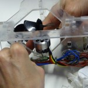
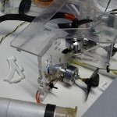
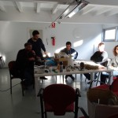
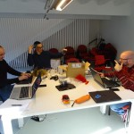
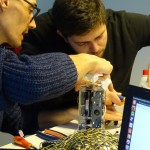

O sábado 16 de Xaneiro de 2016 estivemos no Centro de Interpretación Ambiental de Compostela (CIAC) . Primeiramente estivemos a  reparar e mellorar o OpenRov  co fin de ter un comportamento máis estable neste ano.   Tamén realizamos unha asamblea para  planificar as actividades a desenvolver este ano. Esperamos podervos sorprender nos vindeiros meses.

Algúns dos acordos destacables son:

- A liberación de tódolos videos recopilados co OpenRov  cunha licenza libre
- Rediseño dalgunhas melloras no OpenRov que publicaremos proximamente.
- Planificación das actividades para o 2016 e reparto de responsabilidades.

Esta actividade forma parte das actividades que a asociación Xeopesca realiza no marco do convenio de colaboración asinado coa Axencia para a Modernización Tecnolóxica de Galicia (AMTEGA), e incluídas no Plan de Acción de Software Libre 2016 da Xunta de Galicia.

    
