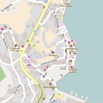
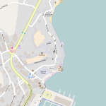

O pasado xoves e venres reuniuse media ducia persoas da contorna da Combarro co obxetivo común de aprender a mapear e coñecer Open Street Maps. A sesión estivo dirixida por Xosé Rial coa colaboración da Aula Cemit de Poio.

A xornada dividiuse en dúas partes principais:

- Introducción a OSM e como se recollen os datos.
- Pequena saída polo casco histórico de Combarro para recoller  información e logo volcar os datos.

Nas seguintes imaxenes podedes observar o antes e o despois de Combarro.

\[caption id="attachment\_719" align="alignleft" width="150"\] Despois da sesión\[/caption\]

\[caption id="attachment\_718" align="alignleft" width="150"\] Antes da sesión de mapeo\[/caption\]

 

 

 

 

 

Deixamovos aqui unha pequena galería de fotos dos participantes:

\[Best\_Wordpress\_Gallery id="19" gal\_title="Mapping Combarro 2016"\]

Esta actividade forma parte das actividades que a asociación Xeopesca realiza no marco do convenio de colaboración asinado coa Axencia para a Modernización Tecnolóxica de Galicia (AMTEGA), e incluídas no Plan de Acción de Software Libre 2016 da Xunta de Galicia.
