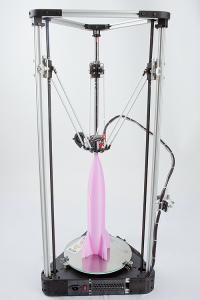
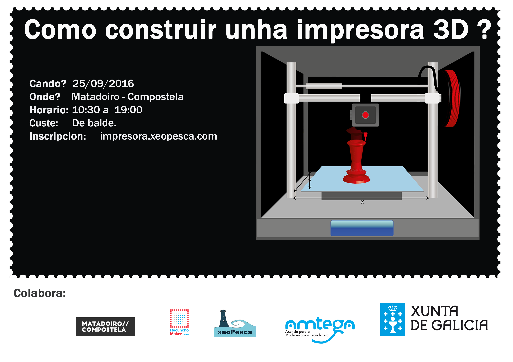

\[caption id="attachment\_727" align="alignright" width="200"\] Impresora Delta\[/caption\]

Dende xeoPesca prácenos presentar o HackLab de montaxe dunha impresora 3D, que iniciara o domingo 25  de setembro ás 10:30 no [Centro do Matadoiro](http://www.matadoirocompostela.com/) (Santiago de Compostela).

O obradoiro consisitirá en construir unha impresora DELTA , exactamente a [Kossel](http://reprap.org/wiki/Kossel) que ten lincenza GPL e podes consultar mais información no seu [repositorio](https://github.com/jcrocholl/kossel).

**Actualización: Prazas esgotadas**

Neste obradoiro veremos:

- Introducción ao hardware libre
- Esquema dos elementos que compón unha impresora 3D
- Firmware da impresora
- Electrónica da impresora e os seus axustes
- Como montar a súa estructura
- Que é o extrusor? Como se axusta?
- Os fins de carro.
- Últimos axustes da impresora 3D.

Algunhas preguntas que che respondemos.

**Onde é?**

**No Matadoiro Compostela,**  un espazo de intervención e autoxestión cidadá. Ubícase na _[antiga Casa da Xuventude](http://www.matadoirocompostela.com/edificio/)._  un edificio de 1600 m2 convertido en territorio aberto para desenvolver proxectos creativos ou sociais e que pretende ser xerador de comunidades produtivas que traballen dun xeito colaborativo e multidisciplinar.

**Quen pode participar?**

Calquera persona maior de idade.

**Que custe ten a actividade?**

Esta actividade é de balde e financiase co Plan de Acción de Software Libre 2016 da Xunta de Galicia.

Dende xeoPesca agradecemos a colaboración do [Recuncho-Maker](http://recunchomaker.org/) e do [Matadoiro](http://www.matadoirocompostela.com/) na execución desta actividade.

Esta actividade forma parte das actividades que a asociación Xeopesca realiza no marco do convenio de colaboración asinado coa Axencia para a Modernización Tecnolóxica de Galicia (AMTEGA), e incluídas no Plan de Acción de Software Libre 2016 da Xunta de Galicia.
