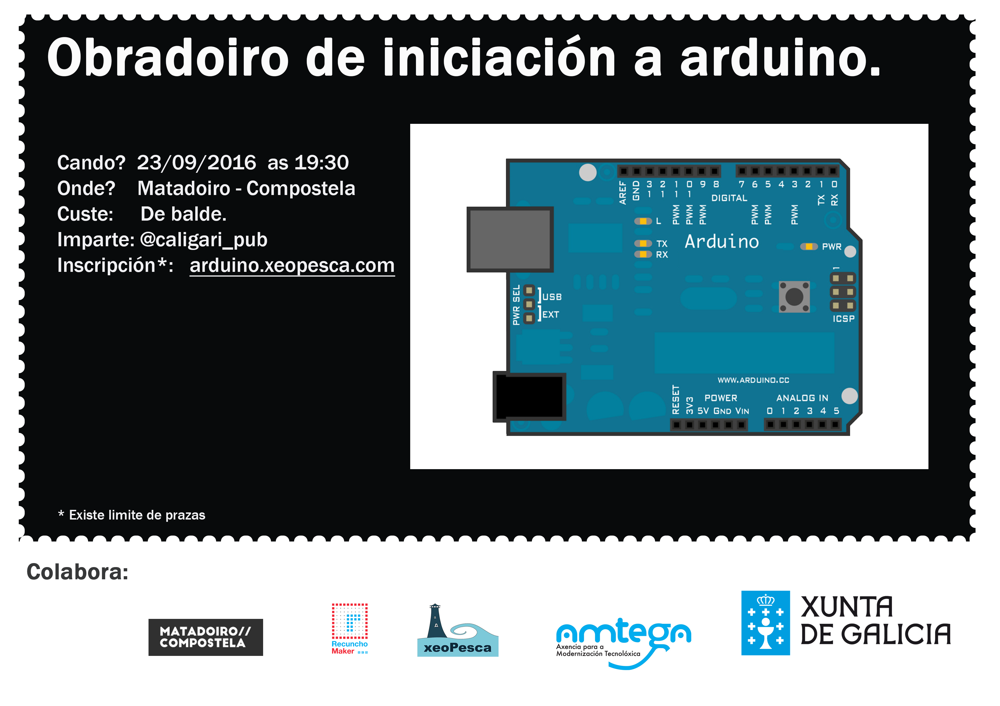

O venres 23 de Setembro  ás 19:30 no [Centro do Matadoiro](http://www.matadoirocompostela.com/) (Santiago de Compostela),

desenvolveremos un obradoiro de Iniciación a Arduino.  Co seguinte temario:

- Estructuras e operadores en Arduino.
- E/S dixital.
- E/S analóxica.
- Exercicios prácticos.

\[caption id="" align="alignright" width="150"\] **Prazas esgotadas**\[/caption\]

Para participar na actividade é preciso [inscribirse previamente](https://docs.google.com/forms/d/e/1FAIpQLScsEpAfGBFX5-rCFUwbaB8PeAKIRMeXBQPvBxEG-gaGyJR3Ng/viewform) xa que as prazas son limitadas e hai que ser maior de idade.

Recordade traer no portatil instalado o IDE de Arduino ([descarga](https://www.arduino.cc/en/Main/Software)).

**Actualización: Prazas esgotadas**

Dende xeoPesca agradecemos a colaboración do [Recuncho-Maker](http://recunchomaker.org/) e do [Matadoiro](http://www.matadoirocompostela.com/) na execución desta actividade.

Esta actividade forma parte das actividades que a asociación Xeopesca realiza no marco do convenio de colaboración asinado coa Axencia para a Modernización Tecnolóxica de Galicia (AMTEGA), e incluídas no Plan de Acción de Software Libre 2016 da Xunta de Galicia.
