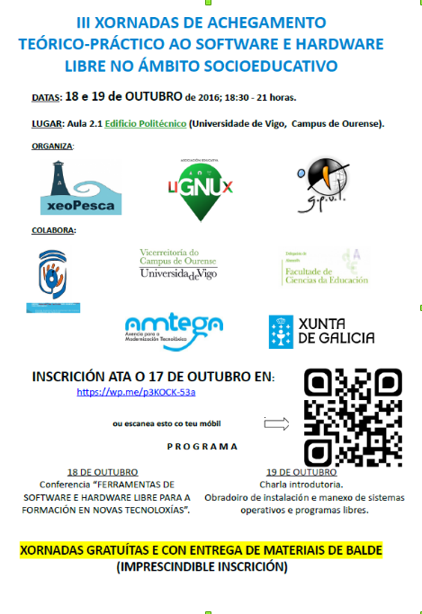

A [Asociación Educativa LiGNUx](https://lignux.com/asociacion-lignux/ "Asociación Educativa LiGNUx") anuncia as “**III** **X****ornadas de acercamento teórico-practico a****o** **software** **e** **hardware libre** **no** **ámbito socioeducativo**”.

As xornadas están organizadas coa colaboración da Asociación Pedagóxica e Cultural Educere, o Grupo de Programadores e Usuarios de Linux (GPUL), a asociación xeoPesca e coa axuda da Universidade de Vigo (Vicerrectoria do Campus de Ourense, Escola Superior de Enxeñería Informática e a Facultade de Ciencias da Educación), ademais da Xunta e a AMTEGA.

**Organización das xornadas**

DATAS: 18 e 19 de OUTUBRO de 2016; 18:30 - 21 horas

LUGAR: Aula 2.1 Edificio de Politécnico (Universidade de Vigo, Campus de Ourense)

PROGRAMA:

- 18 DE OUTUBRO. Conferencia “FERRAMENTAS DE SOFTWARE E HARDWARE LIBRE PARA A FORMACIÓN EN NOVAS TECNOLOXÍAS”.
- 19 DE OUTUBRO. Charla introdutoria e Obradoiro de instalación e manexo de sistemas operativos e programas libres.

Os poñentes para as charlas son:

- Pablo Castro Valiño
- Javier Vila Besada

Todos os interesados nas xornadas poden inscribirse gratuitamente usando o [formulario de inscrición](https://lignux.com/iii-jornadas-de-acercamiento-teorico-practico-al-software-y-hardware-libre-en-el-ambito-socioeducativo/)posto a disposición pola Asociación Educativa LiGNUX na súa propia páxina web.

Esta actividade forma parte das actividades que a asociación Xeopesca realiza no marco do convenio de colaboración asinado coa Axencia para a Modernización Tecnolóxica de Galicia (AMTEGA), e incluídas no Plan de Acción de Software Libre 2016 da Xunta de Galicia.
