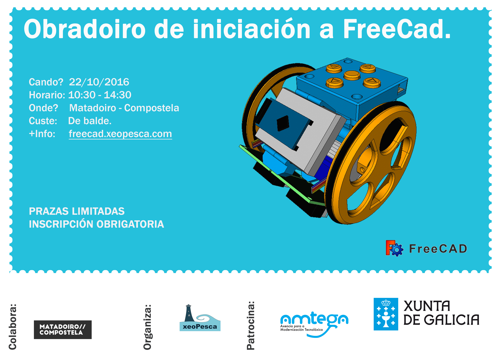

O próximo sábado 22 de Outubro as 10:30  ata as 14:30  no [Centro do Matadoiro](http://www.matadoirocompostela.com/)(Santiago de Compostela), desenvolveremos un obradoiro de FreeCad.  Co seguinte temario:

- Introducción ao CAD
- Interfaz de Freecad
- Entornos de FreeCad, personalización, adicion de modulos
- Entorno Part , Part Design e borrador
- Exportación e importación de pezas
- Exercicios: Creación de sólidos, modificación de solidos e operacións con solidos.
- Outras alternativas libres a FreeCad.

**Material necesario para o obradoiro:**

- Recordade traer portatil para o obradoiro e o cargador
- Instalar a última versión estable de [FreeCad](http://www.freecadweb.org/wiki/index.php?title=Download/es) 

**Que é freeCad?** FreeCAD é un programa de deseño por ordenador en tres dimensións de código libre e aberto.

Esta actividade forma parte das actividades que a asociación Xeopesca realiza no marco do convenio de colaboración asinado coa Axencia para a Modernización Tecnolóxica de Galicia (AMTEGA), e incluídas no Plan de Acción de Software Libre 2016 da Xunta de Galicia.
