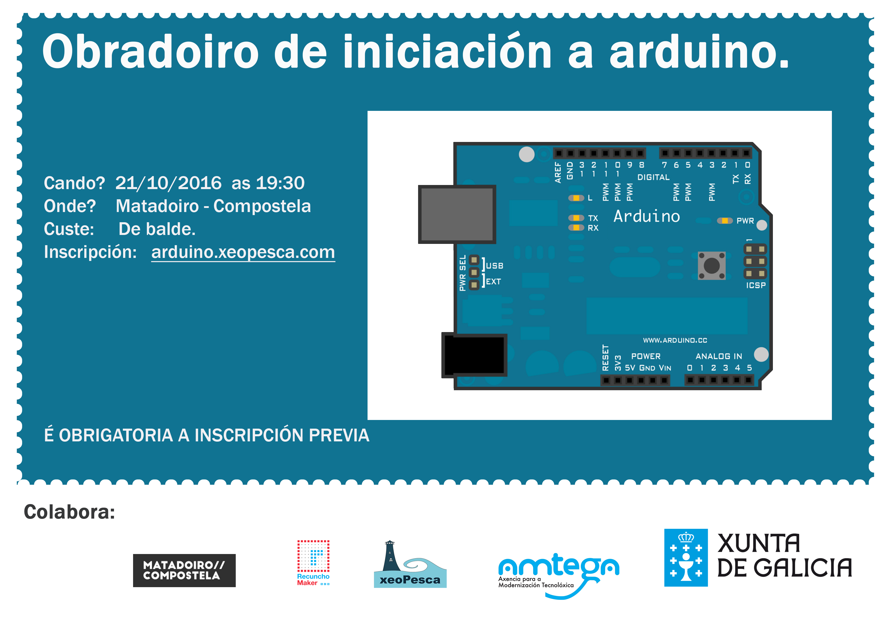

Tras o éxito do mes pasado do obradoiro de iniciación a Arduino, voltamos a repetir outra edición o venres 21 de Outubro ás 19:30 no [Centro do Matadoiro](http://www.matadoirocompostela.com/) (Santiago de Compostela), desenvolveremos un obradoiro de Iniciación a Arduino.  Co seguinte temario:

- Estructuras e operadores en Arduino.
- E/S dixital.
- E/S analóxica.
- Exercicios prácticos.

Para participar na actividade é preciso [inscribirse previamente](https://docs.google.com/forms/d/e/1FAIpQLScy6ACjyI5fuRrgOkWEFvuF7foNln-eBp33Gxll48LnbXHraQ/viewform) xa que as prazas son limitadas e hai que ser maior de idade.

Recordade traer no portatil instalado o IDE de Arduino ([descarga](https://www.arduino.cc/en/Main/Software)).

Dende xeoPesca agradecemos a colaboración do [Recuncho-Maker](http://recunchomaker.org/) e do [Matadoiro](http://www.matadoirocompostela.com/) na execución desta actividade.

Esta actividade forma parte das actividades que a asociación Xeopesca realiza no marco do convenio de colaboración asinado coa Axencia para a Modernización Tecnolóxica de Galicia (AMTEGA), e incluídas no Plan de Acción de Software Libre 2016 da Xunta de Galicia.
