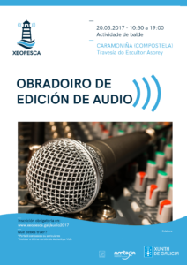

O próximo sábado 20 de Maio no  [Centro Sociocultural de Caramoniña](https://www.openstreetmap.org/#map=19/42.88417/-8.53802) realizaremos un obradoiro de iniciación a edición de audio. O horario do curso será de 10:30 a 14:00 e logo de 15:30a 19:00.  O obradoiro é de balde pero [é preciso inscribirse.](https://www.eventbrite.es/e/entradas-obradoiro-de-edicion-de-audio-33997255707?utm_term=eventurl_text)

[Formulario de inscrición.](https://www.eventbrite.es/e/entradas-obradoiro-de-edicion-de-audio-33997255707?utm_term=eventurl_text)

**Que é necesario para participar no obradoiro?**

- Traer o teu portatil co seu cargador e uns cascos ou auriculares.
- Inscribirte no obradoiro no seguinte enderezo.
- Instalar a última versión de [Audacity](http://www.audacityteam.org/download/) e [VLC](http://www.videolan.org/vlc/) .
- Tamén podes traer calquera trebello que teñas de grabación de són, por se queres resolver dubidas ou compartir o teu coñecementos cos demáis.

\[wpsocialite\]

**Que aprenderás no obradoiro?**

- Como realizar correctamente unha grabación con sofware libre.
- Como editar as grabacións con Audacity
- Conversión e importación entre os diferentes formatos de audio.
- Agregar efectos ao son.

**Que prácticas realizaremos para fudamentar a aprendizaxe?**

- Gravación con diferentes dispositivos en diferentes situacións acústicas
- Nivelación e ecualización dos equipos
- Prácticas de edición e montaxe dun programa con músicas e recursos sonoras

Esta actividade forma parte das actividades que a asociación Xeopesca realiza no marco do convenio de colaboración asinado coa Axencia para a Modernización Tecnolóxica de Galicia (AMTEGA), e incluídas no Plan de Acción de Software Libre 2017 da Xunta de Galicia.
