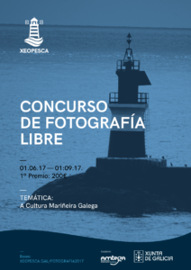

En Galicia temos un patrimonio natural e cultural do que estarmos orgullosos e poder presumir na rede. Dende a Asociación Xeopesca queremos concienciar e fomentar a difusión de fotografías con licenzas libres para dar a coñecer  a nosa terra sen ningún tipo de cancelo.

Nesta primeira edición do Concurso de Fotografía Libre buscamos fotografías coa temática da Cultura Mariñeira Galega, na que se incluen elementos de pesca, artiluxios navais, arquitectura, festas, gastronomía, espazos singulares e demáis asuntos  relacionados coa cultura mariñeira.

O gañador do premio será recompensado con 200€ e o xurado podrá adxudicar un premio accesit de 100€. O xurado estará conformado por dous profesionais da fotografía e polo presidente e secretario da Asociación Xeopesca.

Recomendamos que revisedes as [bases](https://www.xeopesca.gal/wp-content/uploads/2017/05/bases.pdf) con   calma. Un resumo das mesmas é o seguinte:

- **Prazo**: do 1 de Xuño ao 1 de Setembro.
- **Envió das fotografías:** fotografia@xeopesca.gal
- **Formato**: As imaxes podense entregar en formato JPG ou PNG
- **Resolución das imaxes**: As imaxes deben ter unha resolución mínima de  2560 x 1920 píxeles.
- **Licenzas das imaxes**:  [Creative  Commons  Recoñecemento– Compartir Igual](ttps://creativecommons.org/licenses/by-sa/2.5/es/) ou [GNU Free Documentation License](https://www.gnu.org/licenses/fdl-1.3.html)
- **Número de imaxes**: Cada autor pode enviar un máximo de duas fotografías.

_Nota: Ampliase o prazo ata o día  9 de Setembro para subsanación de erros das fotografías enviadas en prazo._

Esta actividade forma parte das actividades que a asociación Xeopesca realiza no marco do convenio de colaboración asinado coa Axencia para a Modernización Tecnolóxica de Galicia (AMTEGA), e incluídas no Plan de Acción de Software Libre 2017 da Xunta de Galicia.
