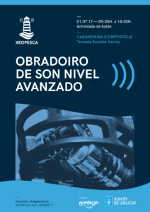

O próximo día 1 de Xullo celebrabremos a segunda sesión do obradoiro de edición de son con Audacity. Nesta sesión repasaremos algúns conceptos da sesión anterior e ampliaremos novos co obxectivo que poidades editar calquera audio.

Nesta sesión o horario será un xornada intensiva de mañan de 9:30 a 14:30 no Centro Social de Caramoniña de Santiago de Compostela. Sito na Travesía Escultor Asorey. Esta edición veremos as diferentes ferramentas para limpar o son, realizar axustes de rango dinámico, ecualización e exportación a diferentes formatos.

O obradoiro é de balde previa inscripción e pode participar calquera persona maior de idade.

[Formulario de inscripción.](https://www.eventbrite.es/e/entradas-obradoiro-de-edicion-de-son-nivel-medio-con-audacity-35110064147) 

**Que é necesario para participar no obradoiro?**

- Traer o teu portatil co seu cargador e uns cascos ou auriculares.
- Inscribirte no obradoiro no seguinte enderezo.
- Instalar a última versión de [Audacity](http://www.audacityteam.org/download/) e [VLC](http://www.videolan.org/vlc/) .
- Tamén podes traer calquera trebello que teñas de grabación de són, por se queres resolver dubidas ou compartir o teu coñecementos cos demáis.

Esta actividade forma parte das actividades que a asociación Xeopesca realiza no marco do convenio de colaboración asinado coa Axencia para a Modernización Tecnolóxica de Galicia (AMTEGA), e incluídas no Plan de Acción de Software Libre 2017 da Xunta de Galicia.

Nesta actividade tamén colabora o RecunchoMaker cedendo o espazo.
