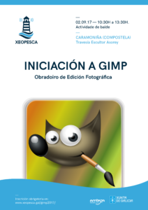

O próximo sábado 2  de Setembro no  [Centro Sociocultural de Caramoniña](https://www.openstreetmap.org/#map=19/42.88417/-8.53802) realizaremos un obradoiro de iniciación a edición fotográfica. O horario do curso será de 10:30 a 13:30.  O obradoiro é de balde pero [é preciso inscribirse.](https://www.eventbrite.es/e/entradas-obradorio-de-iniciacion-a-gimp-37279928269)

[Formulario de inscrición.](https://www.eventbrite.es/e/entradas-obradorio-de-iniciacion-a-gimp-37279928269)

**Que é necesario para participar no obradoiro?**

- Traer o teu portatil co seu cargador .
- Inscribirte no obradoiro no seguinte enderezo.
- Instalar a última versión de  GIMP.
- Tamén podes traer calquera trebello que teñas para sacar fotografías, por se queres resolver dubidas ou compartir o teu coñecementos cos demáis.

**Que aprenderás no obradoiro?**

- Manexarte con diferentes capas e as ferramentas que nos proporciona o GIMP.
- Aplicar correctamente ferramentas como filtros, balances de cor,  brillo e contraste,  tono e saturación.
- Escalado e exportación de imaxes.
- Publicación de fotografías con licenzas libres.

Este obradoiro conta coa colaboración do Recuncho Maker cedenos o espazo do Centro Socio Cultural de Caramoniña para a súa realización.

Esta actividade forma parte das actividades que a asociación Xeopesca realiza no marco do convenio de colaboración asinado coa Axencia para a Modernización Tecnolóxica de Galicia (AMTEGA), e incluídas no Plan de Acción de Software Libre 2017 da Xunta de Galicia.
