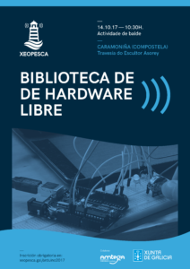

O próximo sábado 14 de Outubro no  [Centro Sociocultural de Caramoniña](https://www.openstreetmap.org/#map=19/42.88417/-8.53802)  xuntaremonos para compartir experiencias co hardware libre  e axudarche a que inicies  proxectos con esta tecnoloxía. Para elo durante as 10:00 e 13:30 teremos un servizo de préstamo de Arduinos e Raspberrys co obxectivo de que afondes na súa aprendizaxe e poidas coolaborar coa comunidade.

Se só queres afondar os teus coñecementos e trebellar teremos a opción de proporvos diferentes problemas para afianzar a túa sabiduria co hardware libre.

**Que é necesario para participar no obradoiro?**

- - Traer o teu portatil co seu cargador .
    - Inscribirte no obradoiro no [seguinte enderezo](https://www.eventbrite.es/e/entradas-biblioteca-de-hardware-libre-38475441080).

_**NOTA: Re-edición da actividade o próximo  21 de Outubro de 2017.**_

Este obradoiro conta coa colaboración do Recuncho Maker cedenos o espazo do Centro Socio Cultural de Caramoniña para a súa realización.

Esta actividade forma parte das actividades que a asociación Xeopesca realiza no marco do convenio de colaboración asinado coa Axencia para a Modernización Tecnolóxica de Galicia (AMTEGA), e incluídas no Plan de Acción de Software Libre 2017 da Xunta de Galicia.
