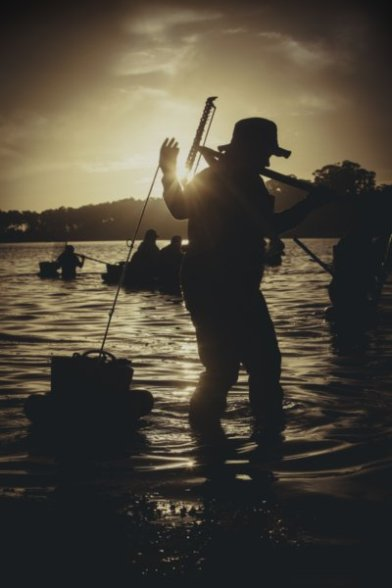
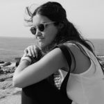
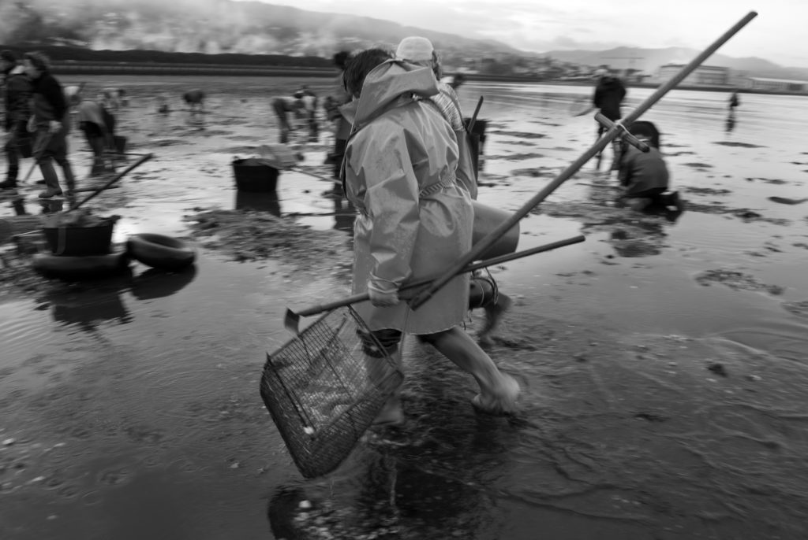

O pasado 8 de outubro de 2017 reuniuse o xurado do certame  formado por polas fotógrafas [Lorena Couto Rey](https://www.facebook.com/azuldoatlantico) e  [Rocío Brage](https://www.facebook.com/Roc%C3%ADo-Brage-732478736783553/). Lorena realizou os seus estudos de fotografía na Escola de Arte Mestre Mateo de Santiago de Compostela e acadou o segundo premio de fotografía no Xuventude Crea 2014. Rocio e técnica superior en fotografía e posúe un  Máster de fotografía na escola EFTI de Madrid, ademais é docente de numerosos cursos de fotografía na Universidade da Coruña. A representación no xurado por parte  da Asociación Xeopesca foi realizada polo Presidente e Secretario.

Nesta primeira edición do concurso de fotografía presentáronse 62 instantáneas válidas según as bases do concurso, que foron realizadas por 43 autores diferentes. As obras presentadas reflicten unha diversidade de intres únicos das nosas paisaxes, costumes, gastronomía,... que conforman a cultura mariñeira galega. Dende o xurado queremos agradecer a todos os participantes por compartir estes recordos cunha licenza libre a toda a comunidade da internet.

Os catros membros do xurado acordan outorgar o **primeiro premio a Roberto Millań** (Alacante), coa fotografía "Mariscadora" na cal pretende amosar o traballo da muller galega na actualidade. A fotografía foi tomada ao amencer cando as mulleres comezan a mariscar na costa do Grove.   Esta obra foi liberada coa licencia GFDL.

O **premio accésit foi gañado por Laura Domínguez Couselo**  (Poio) cunha composición en branco e negro, amosando a dúas mulleres cargando un caldeiro cheo de ameixas e o material de faena. No fondo amosasen outras compañeiras traballando de xeonllos. A instantánea foi realizada na praia de Lourizan (Pontevedra). Esta obra foi liberada coa licencia Creative Commons Recoñecemento – Compartir Igual.

 

__

As restantes fotografías participantes podedes consultalas na seguinte calidade con baixa calidade, pero tamén podes descargarte todas na seguinte ligazón de [github](https://github.com/xeopesca/Concurso-Fotografia-Libre-2017/archive/master.zip).

\[gallery columns="4" ids="1303,1304,1305,1306,1307,1308,1309,1310,1311,1312,1313,1314,1315,1316,1317,1318,1319,1320,1321,1322,1323,1324,1325,1326,1327,1328,1329,1330,1331,1332,1333,1334,1335,1336,1337,1338,1339,1340,1341,1342,1343,1344,1345,1346,1347,1348,1349,1350,1351,1352,1353,1354,1355,1356,1357"\]

Esta actividade forma parte das actividades que a asociación Xeopesca realiza no marco do convenio de colaboración asinado coa Axencia para a Modernización Tecnolóxica de Galicia (AMTEGA), e incluídas no Plan de Acción de Software Libre 2017 da Xunta de Galicia.
