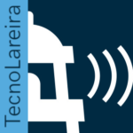

TecnoLareira é un podcast realizado pola Asociación Xeopesca para a difusión da tecnoloxía e a cultura libre. Esta iniciativa ten como obxectivo facer accesible a calquera público as novidades sobre as novas tecnoloxías e os seus usos.  O nome do programa indúcenos a esas conversas sosegadas que se producen ao redor da lareira dun ambiente cordial e familiar.

Nesta primeira entrega publicamos dous programas sobre as criptomoedas, bitcoin e o blockchain. Na primeira sesión mantemos unha conversa introdutoria sobre estes termos entre Javier Alonso, Fran Martínez Hidalgo e Pablo Belay. Posteriormente na segunda sesión contamos cunha sesión maxistral de Roberto Brenlla.

Os podcast están dispoñibles na plataforma [Ivoox](https://www.ivoox.com/podcast-tecnolareira_sq_f1631188_1.html)

 

**Capítulo 1** 

<iframe id="audio_29748171" style="border: 1px solid #EEE; box-sizing: border-box; width: 100%;" src="https://www.ivoox.com/player_ej_29748171_4_1.html?c1=022742" height="200" frameborder="0" scrolling="no" allowfullscreen="allowfullscreen"></iframe>

 

**Capítulo 2**

<iframe id="audio_29748310" style="border: 1px solid #EEE; box-sizing: border-box; width: 100%;" src="https://www.ivoox.com/player_ej_29748310_4_1.html?c1=00243f" height="200" frameborder="0" scrolling="no" allowfullscreen="allowfullscreen"></iframe>
