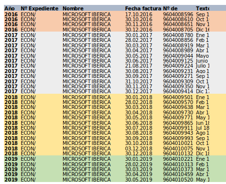
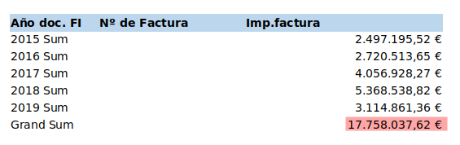
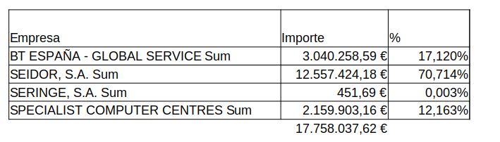

No ano 2019 a Asociación Xeopesca solicitou a AMTEGA información sobre o convenio subscrito con Microsoft no ámbito educativo. En paralelo a Asociación fixo unha petición as diferentes comunidades autónomas para coñecer e comparar o contexto tecnolóxico e a implantación das tecnoloxías libres vs privativas.

No día 17 de Febreiro de 2021 temos a resposta da Comunidade Autónoma de Madrid sobre a situación tecnolóxica nesa comunidade. Nunha primeira análise dos dados sorprende que unicamente se ofreza a información ate xuño de 2019 (data da solicitude) aínda que a resposta sexa elaborada dous anos máis tarde. Este feito non nos permite coñecer a evolución tecnolóxica na situación da pandemia, onde foi fundamental o uso de ferramentas “online” para realizar o teletraballo.

Dos datos ofrecidos descóbrese que MICROSOFT IBERICA S.R.L. facturou nese período 2.479.871,42 €. Tamén que a facturación e case constante e repetitiva de forma mensual entre outubro de 2016 e agosto de 2017 o importe sempre foi de 86.582,05. Posteriormente prodúcese unha rebaixa 17.968,39 € na facturación mensual sendo un total de 68.613,65. Adxúntase unha captura coa información aportada.

Dende o goberno madrileño dísenos que este gasto afecta a 80.000 postos pero sen indicarnos en que anualidade, o cal imposibilita coñecer con exactitude o facturado por Microsoft por posto anualmente. Se temos como referencia o ano 2017 Microsoft cobrou por cada equipo 12,09€ anualmente, mentres no 2018 sería de 10,29€ anuais.

<table><tbody><tr><td>Ano</td><td>Importe</td></tr><tr><td>2016</td><td>346.328,20 €</td></tr><tr><td>2017</td><td>967.111,04 €</td></tr><tr><td>2018</td><td>823.363,88 €</td></tr><tr><td>2019</td><td>343.068,30 €</td></tr><tr><td><strong>Total</strong></td><td><strong>2.479.871,42 €</strong></td></tr></tbody></table>

O gasto en produtos de Microsoft non é unicamente o facturado pola súa matriz en España, ademais existen empresas partner que funcionan como distribuidoras de servizos da multinacional con sede en Redmond. Algunhas destas proveedoras son consultoras da informática como: BT ESPAÑA - GLOBAL SERVICE, SEIDOR, S.A., SERINGE, S.A, SPECIALIST COMPUTER CENTRES. O importe total facturado por estas consultoras é de 17.758.037,62 €. Se obtemos o promedio de gasto facturado por posto de traballo obtemos que no 2017 facturouse 50,71€/ano por equipo e no 2018 un total 67,11€/ano por equipo.

Agrupando a información por empresas proveedoras a principal beneficiada dos contratos é SEIDOR SA acaparando o 70,7% do gasto por un importe de 12.557.424,18 €

Relación de empresas adxudicadas e importes

Para estas empresas partner o concepto de facturación resúmese en tres alternativas: actualización dun sistema, suscripción de licenzas que supoñen a gran maioría das facturas e unha terceira opción que se presenta nun único rexistro que é o mantemento de programas de Microsoft.

No referente ao estudo de alternativas aos produtos de Office365 sorprende que se fale de probas de concepto con alternativas libres con resultados negativos polos usuarios. Sobre estes estudos de concepto non se achega información sobre criterios, obxectivos, plan de seguimento e mellora e tamén da formación correspondente aos usuarios.

A propia institución di que un motivo a valorar é a nula interoperabilidade de aplicativos propios que foron deseñados en exclusiva para o ecosistema das aplicacións Microsoft. No documento remitido di: “_segundo motivo se fundamenta en la imposibilidad de integración de otras herramientas ofimáticas independientes de la suite de Microsoft en distintas aplicaciones de la Comunidad de Madrid, tales como Gestión Procesal o Historia Médica_”. Isto indícanos da forte dependencia tecnolóxica da administración cun modelo de negocio e de ecosistema de aplicativos pechado e pouco interoperable.

No referente ao almacenamento da información na nube de Microsoft Office365 confírmase o que sospeitabamos. O almacenamento principal é en servidores externos aos Centros de Procesamento de Datos da institución é dicir servidores de Microsoft. Tamén se nos indica que os servizos de correo electrónico e algunhas aplicacións propias atópanse nos CPD’s propios.

Pódese consultar integramente a información aportada pola Rexión Madrileña no repositorio de [GitHub](https://github.com/polo-software-libre-na-educacion-galega/peticion-informacion-office-365/tree/master/madrid). No cal podes consultar:

- Resolución a petición de información.
- [DOC 01](https://github.com/polo-software-libre-na-educacion-galega/peticion-informacion-office-365/blob/master/madrid/DOC01.pdf) - Programa Adapta: “Transformando el puesto de trabajo en la Comunidad de Madrid”
- [DOC 02](https://github.com/polo-software-libre-na-educacion-galega/peticion-informacion-office-365/blob/master/madrid/DOC02.pdf) - Prego de Cláusulas Técnicas
- [DOC 03](https://github.com/polo-software-libre-na-educacion-galega/peticion-informacion-office-365/blob/master/madrid/DOC03.pdf) - Prego de Cláusulas Xurídicas
- [DOC 04](https://github.com/polo-software-libre-na-educacion-galega/peticion-informacion-office-365/blob/master/madrid/DOC04.pdf) - Facturas do provedor Microsoft
- [DOC 05](https://github.com/polo-software-libre-na-educacion-galega/peticion-informacion-office-365/blob/master/madrid/DOC05.pdf) - Facturas relacionadas con produtos e servizos de Microsoft.

**Dende a Asociación Xeopesca continuamos agardando pola documentación solicitada a Xunta de Galicia e a AMTEGA no referente aos servizos e produtos contratados.** No ano 2019 fíxose público o dispendio económico de 13,5 millóns de euros en licenzas de código pechado e que tivo como reacción o manifesto “[Polo Software Libre na Educación Galega](https://polo-software-libre-na-educacion-galega.github.io/Manifesto/)”. Comparando os gastos de ámbalas comunidades autónomas, Galicia 13,5 millóns só no 2019 e de 17,7 millóns de Madrid no período 2015-2019. O noso colectivo ve incrementada a nosa preocupación no gasto de solucións privativas e a ausencia de políticas reais na implantación de tecnoloxías libres.
